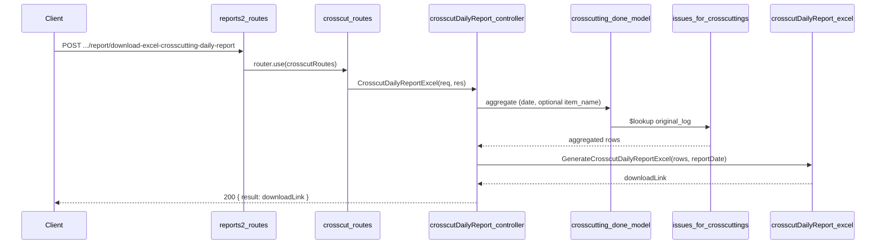

# Crosscut Daily Report API Plan

**Overview:** Add a Crosscut daily report API under reports2 > Crosscut that produces an Excel report matching the specified layout: a main data table with two-row-per-log layout (Log row + LogX row + Total row), item-level totals, a summary table (Item Name, Inward CMT, CC CMT), and operational metadata (CCId, Shift, Work Hours, Worker, Machine Id). Data is sourced from crosscutting_done and issues_for_crosscutting (via lookup).

---

## Report layout (from spec/image)

- **Title:** "CrossCut Details Report Date: DD/MM/YYYY"
- **Main table (9 columns):** Item Name | LogNo | Length | Girth | Inward CMT | LogX | Length | Girth | CC CMT
- **Per log:** Two data rows per piece, then one Total row:
  - **Row 1 (Log row):** Item Name (first of item only), LogNo, Length, Girth, Inward CMT; columns 6–9 empty.
  - **Row 2 (LogX row):** Columns 1–5 empty; LogX, Length, Girth, CC CMT.
  - **Row 3:** "Total" in LogX column; only CC CMT column filled (per-log subtotal).
- **Item-level totals:** Two "Total" rows under LogNo column with item CC CMT total in CC CMT column.
- **Summary:** Table with columns Item Name | Inward CMT | CC CMT; one row per item plus bold **Total** row.
- **Operational:** Table CCId | Shift | Work Hours | Worker | Machine Id (one row per unique worker/machine).

## Data source (schema)

- **crosscutting.schema.js** (`topl_backend/database/schema/factory/crossCutting/crosscutting.schema.js`)
  - **crosscutting_done:** `issue_for_crosscutting_id`, `log_no`, `code`, `log_no_code`, `length`, `girth`, `crosscut_cmt`, `item_name`, `worker_details` (crosscut_date, shift, working_hours, workers), `machine_id`, `machine_name`, `deleted_at`.

- **issuedForCutting.schema.js** (`topl_backend/database/schema/factory/crossCutting/issuedForCutting.schema.js`)
  - **issues_for_crosscutting:** `_id`, `log_no`, `physical_length`, `physical_diameter`, `physical_cmt`, `item_name`. Join: `crosscutting_done.issue_for_crosscutting_id` → `issues_for_crosscutting._id`. MongoDB collection name in $lookup: `issues_for_crosscuttings`.

## API contract

- **Endpoint:** `POST /api/V1/report/download-excel-crosscutting-daily-report`
- **Request body:** `{ "filters": { "reportDate": "YYYY-MM-DD" } }`  
  Optional: `item_name` (e.g. "RED OAK") to restrict to one wood type.
- **Success (200):** `{ result: "<APP_URL>/public/reports/CrossCutting/...", statusCode: 200, status: "success", message: "..." }`
- **Errors:** 400 if `reportDate` missing; 404 if no data for the date.

## File structure

| Purpose         | Path |
| --------------- | ----- |
| Controller      | `controllers/reports2/Crosscut/crosscutDailyReport.js` |
| Excel generator | `config/downloadExcel/reports2/Crosscut/crosscutDailyReport.js` |
| Routes          | `routes/report/reports2/Crosscut/crosscut.routes.js` |
| Mount           | `routes/report/reports2.routes.js` — use `router.use(crosscutRoutes)` |

## Implementation steps

### 1. Controller — `controllers/reports2/Crosscut/crosscutDailyReport.js`

- Use `catchAsync`; validate `reportDate` from `req.body.filters`; optionally read `item_name`.
- Date range: start-of-day to end-of-day for `reportDate`.
- Aggregation pipeline:
  - **$match** on `crosscutting_done`: `worker_details.crosscut_date` in range, `deleted_at: null`; if `item_name` provided, add `item_name`.
  - **$lookup** `issues_for_crosscuttings` on `issue_for_crosscutting_id` → `_id`, as `original_log`.
  - **$unwind** `original_log` (preserveNullAndEmptyArrays: true).
  - **$sort** by `item_name`, `log_no`, `code`.
- If no documents: return 404.
- Call Excel generator with (aggregated rows, reportDate); return 200 with download link.

### 2. Excel config — `config/downloadExcel/reports2/Crosscut/crosscutDailyReport.js`

- Export `GenerateCrosscutDailyReportExcel(details, reportDate)`.
- Use ExcelJS; date format DD/MM/YYYY.
- **Sheet layout:**
  - Row 1: merged title — "CrossCut Details Report Date: &lt;formattedDate&gt;".
  - Main table: headers — Item Name, LogNo, Length, Girth, Inward CMT, LogX, Length, Girth, CC CMT.
  - Group data by item_name and log_no. For each piece: Row 1 (Log): cols 1–5 from original_log (item name on first of item, log info on first of log); cols 6–9 empty. Row 2 (LogX): cols 1–5 empty; cols 6–9 = LogX, length, girth, CC CMT. Row 3: "Total" in col 6, per-log CC CMT sum in col 9.
  - After each item: two item total rows (Total in LogNo column, item CC CMT total in col 9).
  - Summary table: Item Name | Inward CMT | CC CMT; one row per item, then bold Total row.
  - Operational section: headers CCId, Shift, Work Hours, Worker, Machine Id; one row per unique worker/machine (CCId from first doc _id e.g. last 5 chars).
- Styling: bold headers, gray fill (e.g. D3D3D3), thin borders, 0.000 for CMT/dimensions.
- Save to `public/reports/CrossCutting/crosscutting_daily_report_&lt;timestamp&gt;.xlsx`; return `APP_URL + filePath`.

### 3. Routes — `routes/report/reports2/Crosscut/crosscut.routes.js`

- Import `CrosscutDailyReportExcel` from the new controller and `express.Router()`.
- Define: `router.post('/download-excel-crosscutting-daily-report', CrosscutDailyReportExcel)`.
- Export default router.

### 4. Mount Crosscut routes — `routes/report/reports2.routes.js`

- Import crosscut routes: `import crosscutRoutes from './reports2/Crosscut/crosscut.routes.js';`
- Add: `router.use(crosscutRoutes);` (no path prefix, so full path remains `/download-excel-crosscutting-daily-report` under the report base).
- Remove any direct `router.post(..., CrossCuttingDailyReportExcel)` that pointed at the old controller.

## Flow summary

## Notes

- **CCId:** Not a dedicated schema field; derived from first document _id (e.g. last 5 characters) for the operational section.
- **Two-row-per-log:** Exact layout per spec: Log row (cols 1–5), LogX row (cols 6–9), then Total row (col 6 = "Total", col 9 = log CC CMT sum).
- **Item totals:** Two "Total" rows per item, both showing the same item CC CMT total in column 9.
- **Worker/ops:** One row per unique (machine_id, shift) with worker_details and machine_name/machine_id.
