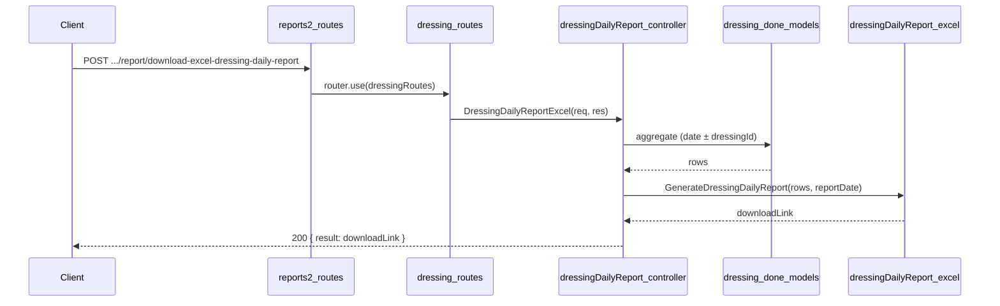

# Dressing Daily Report API Plan

**Overview:** Add a Dressing daily report API under reports2 > Dressing that produces an Excel report matching the provided images: a details table (Item Name, LogX, Bundle No, ThickneSS, Length, Width, Leaves, Sq Mtr, Character, Pattern, Series, Remarks), optional two-panel summary with totals, and metadata (Dressing Id, Shift, Work Hours, Worker, Machine Id). Data is sourced from dressing_done_other_details and dressing_done_items.

---

## Report layout (from images)

- **Title:** "Dressing Details Report Date: DD/MM/YYYY"
- **Details table (image 1):** Columns — Item Name, LogX, Bundle No, ThickneSS, Length, Width, Leaves, Sq Mtr, Character, Pattern, Series, Remarks. Rows grouped by Item Name and LogX (log_no_code).
- **Summary (image 2):** Two tables side by side: left — first column (bundle/leaves), Thickness, Length, Width; right — Leaves, Sq Mtr, Character, Pattern, Series. Total row(s) (e.g. 207, 4977, 6621.12).
- **Metadata row:** Dressing Id, Shift, Work Hours, Worker, Machine Id. (Machine Id is not in current schema; show blank or omit.)

## Data source (schema)

- **dressing.done.schema.js** (`topl_backend/database/schema/factory/dressing/dressing_done/dressing.done.schema.js`)
  - **dressing_done_other_details:** `dressing_date`, `shift`, `no_of_workers`, `no_of_working_hours`, `no_of_total_hours`, `created_by`. Use `_id` as "Dressing Id".
  - **dressing_done_items:** `dressing_done_other_details_id`, `log_no_code` (→ LogX), `item_name`, `bundle_number`, `thickness`, `length`, `width`, `no_of_leaves`, `sqm` (→ Sq Mtr), `character_name`, `pattern_name`, `series_name`, `remark` (→ Remarks).

Worker name: resolve `created_by` via lookup to `users` (first_name, last_name), same pattern as slicingDailyReport.js.

## API contract

- **Endpoint:** `POST /api/v1/report/download-excel-dressing-daily-report`
- **Request body:** `{ "filters": { "reportDate": "YYYY-MM-DD" } }`  
  Optional: `dressingId` (ObjectId of dressing_done_other_details) to restrict to one session; if omitted, include all sessions for that date.
- **Success (200):** `{ result: "<APP_URL>/public/reports/Dressing/...", statusCode: 200, status: "success", message: "..." }`
- **Errors:** 400 if `reportDate` missing; 404 if no data for the date (or for the given dressingId).

## File structure

| Purpose         | Path |
| --------------- | ----- |
| Controller      | `controllers/reports2/Dressing/dressingDailyReport.js` (new) |
| Excel generator | `config/downloadExcel/reports2/Dressing/dressingDailyReport.js` (new) |
| Routes          | `routes/report/reports2/Dressing/dressing.routes.js` (currently empty) |
| Mount           | `routes/report/reports2.routes.js` — add dressing router |

## Implementation steps

### 1. Controller — `controllers/reports2/Dressing/dressingDailyReport.js`

- Use `catchAsync`, validate `reportDate` from `req.body.filters`; optionally read `dressingId`.
- Date range: start-of-day to end-of-day for `reportDate`.
- Aggregation pipeline:
  - **$match** on `dressing_done_other_details`: `dressing_date` in range; if `dressingId` provided, also `_id: ObjectId(dressingId)`.
  - **$lookup** `dressing_done_items` on `_id` → `dressing_done_other_details_id`.
  - **$unwind** items.
  - **$lookup** `users` on `created_by` for worker name (first_name, last_name).
  - **$sort** by `item_name`, `log_no_code`, `bundle_number`.
  - **$project** fields needed for Excel: item_name, log_no_code, bundle_number, thickness, length, width, no_of_leaves, sqm, character_name, pattern_name, series_name, remark; from other_details: _id (dressingId), shift, no_of_working_hours, no_of_workers; worker name from users.
- If no documents: return 404.
- Call Excel generator with (rows, reportDate); return 200 with download link.

### 2. Excel config — `config/downloadExcel/reports2/Dressing/dressingDailyReport.js`

- Export `GenerateDressingDailyReport(rows, reportDate)`.
- Use ExcelJS; date format DD/MM/YYYY (reuse pattern from logInward.js / slicingDailyReport.js).
- **Sheet layout:**
  - Row 1: merged title — "Dressing Details Report Date: &lt;formattedDate&gt;".
  - Details table: headers — Item Name, LogX, Bundle No, ThickneSS, Length, Width, Leaves, Sq Mtr, Character, Pattern, Series, Remarks. One row per item; group visually by item_name and log_no_code (repeat or leave first cell per group).
  - Below details (or after a blank row): two tables side by side matching image 2 — left: numeric columns (e.g. Bundle No or Leaves, Thickness, Length, Width); right: Leaves, Sq Mtr, Character, Pattern, Series. Add "Total" row(s) with sum of leaves and sum of Sq Mtr (and any other totals shown in the image).
  - Metadata row: labels Dressing Id, Shift, Work Hours, Worker, Machine Id; values from first session (dressingId, shift, no_of_working_hours, worker name from users; Machine Id blank).
- If multiple sessions (date-only, no dressingId): either one block per session (details + summary + metadata per dressing Id) or a single combined details table and one metadata row (e.g. first session). Prefer one section per session so each "Dressing Id" matches its data.
- Styling: bold headers, gray fill (e.g. D3D3D3), thin borders, number formats for decimals.
- Save to `public/reports/Dressing/dressing_daily_report_&lt;timestamp&gt;.xlsx`; return `APP_URL + filePath`.

### 3. Routes — `routes/report/reports2/Dressing/dressing.routes.js`

- Import `DressingDailyReportExcel` from the new controller and `express.Router()`.
- Define: `router.post('/download-excel-dressing-daily-report', DressingDailyReportExcel)`.
- Export default router.

### 4. Mount Dressing routes — `routes/report/reports2.routes.js`

- Import dressing routes: `import dressingRoutes from './reports2/Dressing/dressing.routes.js';`
- Add: `router.use(dressingRoutes);` (same pattern as Log, Flitch, Slicing — no path prefix, so full path is `/download-excel-dressing-daily-report` under the report base).

## Flow summary

## Notes

- **ThickneSS:** Use the exact header spelling from the image (capital S at end) in the Excel.
- **Machine Id:** Not present in `dressing_done_other_details`; include column/label and leave value empty unless you add it elsewhere later.
- **Worker:** Map to user display name from `created_by`; use "Worker" for the label. If you need "Work Hours" and "Worker" both, use `no_of_working_hours` for Work Hours and resolved user name for Worker.
- **Totals:** From image 2, compute total leaves and total Sq Mtr (and any other totals) and place in the summary Total row(s).
