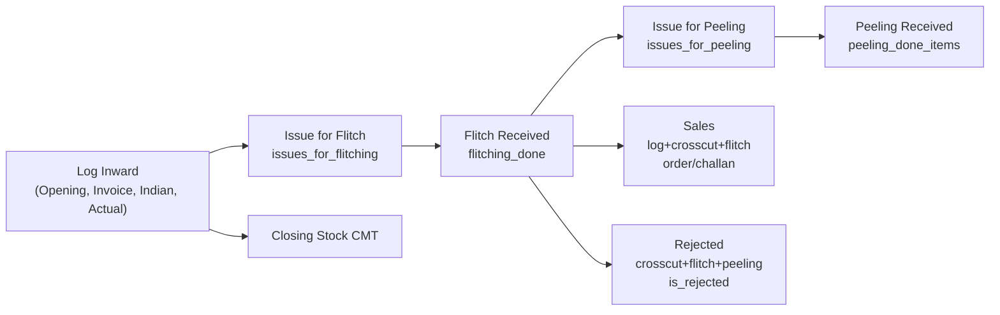

# Item Wise Flitch Report API

## Overview
The Item Wise Flitch Report API generates an Excel report tracking inventory movements by item
name over a specified date range. The report uses a **20-column layout** with grouped sections:
Round Log Detail CMT (Invoice, Indian, Actual), Cross Cut Details CMT (Issue for CC, CC Received,
CC Issue, CC Diff), Flitch Details CMT, Peeling Details CMT, Round log + Cross Cut (Sales),
(Cc+Flitch+Peeling) (Rejected), and Closing Stock CMT.

## Endpoint
```
POST /api/V1/report/download-excel-item-wise-flitch-report
```

## Authentication
- Requires: `AuthMiddleware`
- Permission: Standard user authentication

## Request Body

### Required Parameters
```json
{
  "startDate": "2025-03-01",
  "endDate": "2025-03-31"
}
```

### Optional Parameters
```json
{
  "startDate": "2025-03-01",
  "endDate": "2025-03-31",
  "filter": {
    "item_name": "RED OAK"
  }
}
```

## Response

### Success Response (200 OK)
```json
{
  "statusCode": 200,
  "status": "success",
  "message": "Item wise flitch report generated successfully",
  "result": "http://localhost:5000/public/upload/reports/reports2/Flitch/Item-Wise-Flitch-Report-<timestamp>.xlsx"
}
```

### Error Responses

#### 400 Bad Request – Missing Parameters
```json
{
  "statusCode": 400,
  "status": "error",
  "message": "Start date and end date are required"
}
```

#### 400 Bad Request – Invalid Date Format
```json
{
  "statusCode": 400,
  "status": "error",
  "message": "Invalid date format. Use YYYY-MM-DD"
}
```

#### 400 Bad Request – Invalid Date Range
```json
{
  "statusCode": 400,
  "status": "error",
  "message": "Start date cannot be after end date"
}
```

#### 404 Not Found
```json
{
  "statusCode": 404,
  "status": "error",
  "message": "No flitch data found for the selected period"
}
```

---

## Report Structure

### Row 1: Report Title
Merged across all 20 columns.

**Format:** `Inward Item Wise Report From DD/MM/YYYY to DD/MM/YYYY`

**With item filter:** `Inward Item Wise Report [ RED OAK ] From 01/03/2025 to 31/03/2025`

### Row 2: Empty (spacing)

### Row 3: Group Headers (merged cells)

| Columns | Group Label |
|---------|-------------|
| 3 – 5   | Round Log Detail CMT (Invoice, Indian, Actual) |
| 7 – 10  | Cross Cut Details CMT (Issue for CC, CC Received, CC Issue, CC Diff) |
| 11 – 13 | Flitch Details CMT (Issue for Flitch, Flitch Received, Flitch Diff) |
| 14 – 16 | Peeling Details CMT (Issue for Peeling, Peeling Received, Peeling Diff) |
| 18      | Round log +Cross Cut (Sales) |
| 19      | (Cc+Flitch+Peeling) (Rejected) |
| 1, 2, 6, 17, 20 | Standalone (ItemName, Opening Stock, Recover From rejected, Issue for Sq.Edge, Closing Stock CMT) |

### Row 4: Column Headers (20 columns)

| # | Column | Description |
|---|--------|-------------|
| 1 | ItemName | Wood species name |
| 2 | Opening Stock CMT | Physical CMT of logs (inward in period) |
| 3 | Invoice | Invoice CMT of logs received in the period |
| 4 | Indian | Indian CMT of logs received in the period |
| 5 | Actual | Actual (physical) CMT of logs received in the period |
| 6 | Recover From rejected | Placeholder – 0 (data source TBD) |
| 7 | Issue for CC | Log items issued for crosscutting (createdAt in period, issue_status crosscutting) |
| 8 | CC Received | Crosscut completions (createdAt in period) |
| 9 | CC Issue | Crosscut pieces issued forward (createdAt in period, issue_status not null) |
| 10 | CC Diff | Issue for CC − CC Received |
| 11 | Issue for Flitch | Records from `issues_for_flitching` (createdAt in period) |
| 12 | Flitch Received | Flitching completions (createdAt in period, deleted_at null) |
| 13 | Flitch Diff | Issue for Flitch − Flitch Received |
| 14 | Issue for Peeling | Records from `issues_for_peeling` (createdAt in period) |
| 15 | Peeling Received | Peeling completions via `peeling_done_items` (createdAt in period) |
| 16 | Peeling Diff | Issue for Peeling − Peeling Received |
| 17 | Issue for Sq.Edge | Placeholder – 0 (data source TBD) |
| 18 | Sales | Log + Crosscut + Flitch with issue_status order/challan (createdAt in period) |
| 19 | Rejected | Crosscut + Flitch + Peeling with is_rejected=true (createdAt in period) |
| 20 | Closing Stock CMT | Logs in period with issue_status != null, minus Opening Stock |

### Rows 5+: Data rows (one per item, sorted alphabetically)

### Last Row: Grand Total (bold, light gray background)

---

## Report Features

- **20 columns** with grouped header row (Round Log Detail CMT, Cross Cut Details CMT, Flitch Details CMT, Peeling Details CMT, Sales, Rejected, Closing Stock)
- **Sorted data**: items sorted alphabetically by name
- **Grand Total row**: sums numeric columns, bold with gray background
- **Gray background**: group header and column header rows (#FFD3D3D3)
- **3 decimal precision**: all CMT values formatted to 3 decimal places
- **Item filter**: optional `filter.item_name` narrows the report to one species
- **Activity filter**: items with all-zero values are excluded

---

## Stock Calculation Logic

All values are in **CMT (Cubic Meter)**. The date range filter (`createdAt` or `inward_date`) is applied to each aggregation.

### Opening Stock CMT
```
Sum of physical_cmt from log_inventory_items
WHERE log_inventory_invoice_details.inward_date IN [startDate, endDate]
```

### Invoice / Indian / Actual CMT
Same log + invoice lookup as Opening Stock; sums `invoice_cmt`, `indian_cmt`, `physical_cmt` respectively.

### Issue for CC (Cross Cut)
```
Sum of physical_cmt from log_inventory_items
WHERE createdAt IN [startDate, endDate] AND issue_status = 'crosscutting'
```

### CC Received
```
Sum of crosscut_cmt from crosscutting_done
WHERE createdAt IN [startDate, endDate]
```

### CC Issued
```
Sum of crosscut_cmt from crosscutting_done
WHERE createdAt IN [startDate, endDate] AND issue_status IS NOT NULL
```

### CC Diff
```
CC Diff = Issue for CC − CC Received
```

### Issue for Flitch
```
Sum of cmt from issues_for_flitching
WHERE createdAt IN [startDate, endDate]
```

### Flitch Received
```
Sum of flitch_cmt from flitching_done
WHERE createdAt IN [startDate, endDate] AND deleted_at IS NULL
```

### Flitch Diff
```
Flitch Diff = Issue for Flitch − Flitch Received
```

### Issue for Peeling
```
Sum of cmt from issues_for_peeling
WHERE createdAt IN [startDate, endDate]
```

### Peeling Received
```
Sum of peeling_done_items.cmt
via peeling_done_other_details (createdAt IN [startDate, endDate])
joined to peeling_done_items on peeling_done_other_details_id
```

### Peeling Diff
```
Peeling Diff = Issue for Peeling − Peeling Received
```

### Sales
```
Sum of physical_cmt  (log_inventory_items,  issue_status IN ['order','challan'], createdAt in range)
+ Sum of crosscut_cmt (crosscutting_done,    issue_status IN ['order','challan'], createdAt in range)
+ Sum of flitch_cmt   (flitching_done,        issue_status IN ['order','challan'], createdAt in range, deleted_at null)
```

### Rejected
```
Sum of crosscut_cmt (crosscutting_done, is_rejected=true, createdAt in range)
+ Sum of flitch_cmt  (flitching_done,    is_rejected=true, createdAt in range, deleted_at null)
+ Sum of peeling_done_items.cmt (peeling_done_other_details is_rejected=true, createdAt in range)
```

### Closing Stock CMT
```
Closing = MAX(0,
  Sum of physical_cmt (log_inventory_items, inward in range, issue_status IS NOT NULL)
  − Opening Stock CMT
)
```

### Placeholder fields (always 0)
- **Recover From rejected** – data source not yet defined
- **Issue for Sq.Edge** – data source not yet defined

---

## Data Flow



---

## Database Collections

| Collection | Model | Key Fields Used |
|------------|-------|-----------------|
| `log_inventory_items_details` | `log_inventory_items_model` | `physical_cmt`, `invoice_cmt`, `indian_cmt`, `issue_status`, `createdAt` |
| `log_inventory_invoice_details` | (lookup) | `inward_date` |
| `crosscutting_dones` | `crosscutting_done_model` | `crosscut_cmt`, `issue_status`, `is_rejected`, `createdAt` |
| `issued_for_flitchings` | `issues_for_flitching_model` | `cmt`, `item_name`, `createdAt` |
| `flitchings` | `flitching_done_model` | `flitch_cmt`, `issue_status`, `is_rejected`, `deleted_at`, `createdAt` |
| `issued_for_peelings` | `issues_for_peeling_model` | `cmt`, `item_name`, `createdAt` |
| `peeling_done_other_details` | `peeling_done_other_details_model` | `createdAt`, `is_rejected` |
| `peeling_done_items` | (lookup via `peeling_done_other_details_id`) | `item_name`, `cmt` |

---

## Example Request

### cURL
```bash
curl -X POST http://localhost:5000/api/V1/report/download-excel-item-wise-flitch-report \
  -H "Content-Type: application/json" \
  -H "Authorization: Bearer YOUR_TOKEN" \
  -d '{
    "startDate": "2025-03-01",
    "endDate": "2025-03-31"
  }'
```

### With Item Filter
```bash
curl -X POST http://localhost:5000/api/V1/report/download-excel-item-wise-flitch-report \
  -H "Content-Type: application/json" \
  -H "Authorization: Bearer YOUR_TOKEN" \
  -d '{
    "startDate": "2025-03-01",
    "endDate": "2025-03-31",
    "filter": {
      "item_name": "RED OAK"
    }
  }'
```

---

## File Information

**Generated File Name Format:**
```
Item-Wise-Flitch-Report-{timestamp}.xlsx
```

**Storage Location:**
```
public/upload/reports/reports2/Flitch/
```

**File Format:** Excel (.xlsx)

**Worksheet Name:** Item Wise Flitch Report

---

## Implementation Files

| Purpose | Path |
|---------|------|
| Controller | `topl_backend/controllers/reports2/Flitch/itemWiseFlitch.js` |
| Excel Generator | `topl_backend/config/downloadExcel/reports2/Flitch/itemWiseFlitch.js` |
| Route | `topl_backend/routes/report/reports2/Flitch/flitch.routes.js` |

**Route:** `POST /api/V1/report/download-excel-item-wise-flitch-report`

---

## Notes

1. **Date Format:** All dates in `YYYY-MM-DD` format.
2. **Deleted Records:** Flitch aggregations filter `deleted_at IS NULL`.
3. **Activity Filter:** Items where all numeric columns are zero are excluded.
4. **End Date Inclusive:** End date includes full day up to 23:59:59.999.
5. **Decimal Precision:** All CMT values formatted to 3 decimal places.
6. **Sorting:** Results sorted alphabetically by item name.
7. **Placeholder columns:** Recover From rejected and Issue for Sq.Edge always output 0 until a data source is defined by the client.
8. **Item universe:** Unique `item_name` values from `flitching_done` (deleted_at null).
9. **Cross Cut section:** Issue for CC, CC Received, CC Issue, CC Diff are included (columns 7–10); data from `log_inventory_items` (issue_status crosscutting) and `crosscutting_done`.

---

## Version History

| Version | Date | Changes |
|---------|------|---------|
| 1.0.0 | 2025-02-03 | Initial implementation (7 columns) |
| 2.0.0 | 2026-03-06 | Expanded to 21 columns matching full Inward Item Wise layout |
| 3.0.0 | 2026-03-06 | 20 columns with Round Log Detail CMT, Cross Cut Details CMT, Flitch Details CMT, Peeling Details CMT, Sales, Rejected, Closing Stock; title "Inward Item Wise Report From…to…" |

---

## Related APIs

- [Flitch Daily Report API](../Daily_Flitch/FLITCH_DAILY_REPORT_API.md)
- [Log Wise Flitch Report API](../Log_wise_flitch/LOG_WISE_FLITCH_REPORT_API.md)
