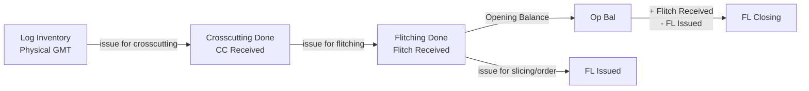

# Item Wise Flitch Report API

## Overview
The Item Wise Flitch Report API generates comprehensive Excel reports tracking flitch inventory movements by item name over a specified date range. The report shows opening balance, crosscut received, flitch received, flitch issued, and closing balance for each wood item.

## Endpoint
```
POST /api/V1/reports2/flitch/download-excel-item-wise-flitch-report
```

## Authentication
- Requires: `AuthMiddleware`
- Permission: Standard user authentication

## Request Body

### Required Parameters
```json
{
  "startDate": "2025-03-01",
  "endDate": "2025-03-31"
}
```

### Optional Parameters
```json
{
  "startDate": "2025-03-01",
  "endDate": "2025-03-31",
  "filter": {
    "item_name": "RED OAK"
  }
}
```

## Response

### Success Response (200 OK)
```json
{
  "statusCode": 200,
  "status": "success",
  "message": "Item wise flitch report generated successfully",
  "result": "http://localhost:5000/public/upload/reports/reports2/Flitch/Item-Wise-Flitch-Report-1738234567890.xlsx"
}
```

### Error Responses

#### 400 Bad Request - Missing Parameters
```json
{
  "statusCode": 400,
  "status": "error",
  "message": "Start date and end date are required"
}
```

#### 400 Bad Request - Invalid Date Format
```json
{
  "statusCode": 400,
  "status": "error",
  "message": "Invalid date format. Use YYYY-MM-DD"
}
```

#### 400 Bad Request - Invalid Date Range
```json
{
  "statusCode": 400,
  "status": "error",
  "message": "Start date cannot be after end date"
}
```

#### 404 Not Found
```json
{
  "statusCode": 404,
  "status": "error",
  "message": "No flitch data found for the selected period"
}
```

## Report Structure

The generated Excel report has the following structure:

### Row 1: Report Title
Displays the date range and optional item filter in a merged cell.

**Format:**
```
Itemwise Flitch between DD/MM/YYYY and DD/MM/YYYY
```

**Examples:**

**With specific item filter:**
```
Itemwise Flitch [ RED OAK ] between 01/03/2025 and 31/03/2025
```

**Without item filter (all items):**
```
Itemwise Flitch between 01/03/2025 and 31/03/2025
```

### Row 2: Empty (spacing)

### Row 3: Column Headers

The data table contains the following 7 columns:

1. **Item Name** - Wood species name (e.g., RED OAK, AMERICAN WALNUT, SAPELI)
2. **Physical GMT** - Current available CMT in log inventory (where issue_status = null)
3. **CC Received** - Crosscut items completed during the date range
4. **Op Bal** - Opening balance of flitch items at the start of the period
5. **Flitch Received** - Flitch items created during the date range
6. **FL Issued** - Flitch items issued (for slicing/order/challan) during the period
7. **FL Closing** - Closing balance at the end of the period

### Rows 4+: Data Table

Each row represents one item with all calculated values.

**Example data row:**
| Item Name | Physical GMT | CC Received | Op Bal | Flitch Received | FL Issued | FL Closing |
|-----------|-------------|-------------|--------|----------------|-----------|------------|
| RED OAK | 6.602 | 6.602 | 0.000 | 6.063 | 0.000 | 6.063 |
| SAPELI | 0.000 | 0.000 | 25.564 | 0.000 | 2.913 | 22.651 |

### Last Row: Grand Total

The total row sums all numeric columns and is styled with:
- Bold text
- Light gray background (#FFE0E0E0)

**Example:**
| Item Name | Physical GMT | CC Received | Op Bal | Flitch Received | FL Issued | FL Closing |
|-----------|-------------|-------------|--------|----------------|-----------|------------|
| **Total** | **6.602** | **6.602** | **20.742** | **6.063** | **2.913** | **23.892** |

## Report Features

- **Title Row**: Displays date range and applied filters with bold formatting
- **Sorted Data**: Items sorted alphabetically by name
- **Grand Total**: Overall totals across all items at the bottom
- **Bold Formatting**: Headers and total row are bold for easy reading
- **Gray Background**: Header row has gray background (#FFD3D3D3) for visibility
- **Decimal Precision**: All CMT values shown with 3 decimal places
- **Filter Option**: Can filter report to show only specific item
- **Activity Filter**: Only shows items with activity (non-zero values)

## Stock Calculation Logic

**All calculations are performed in CMT (Cubic Meter).**

### 1. Physical GMT (Current Stock in Log Inventory)
```
Physical GMT = Sum of physical_cmt from log_inventory_items_model
WHERE issue_status IS NULL OR issue_status DOES NOT EXIST
```

**Data Source:** `log_inventory_items_model`
**Field Used:** `physical_cmt`
**Filter:** Current available stock (not issued)

### 2. CC Received (Crosscut Completed)
```
CC Received = Sum of crosscut_cmt from crosscutting_done_model
WHERE createdAt >= startDate AND createdAt <= endDate
```

**Data Source:** `crosscutting_done_model`
**Field Used:** `crosscut_cmt`
**Filter:** Items created within the date range

### 3. Flitch Received (Flitching Completed)
```
Flitch Received = Sum of flitch_cmt from flitching_done_model
WHERE worker_details.flitching_date >= startDate 
  AND worker_details.flitching_date <= endDate
  AND deleted_at IS NULL
```

**Data Source:** `flitching_done_model`
**Field Used:** `flitch_cmt`
**Filter:** Items created within the date range, not deleted

### 4. Flitch Issued (Sent for Further Processing/Sales)
```
Flitch Issued = Sum of flitch_cmt from flitching_done_model
WHERE issue_status IN ('slicing', 'slicing_peeling', 'order', 'challan')
  AND updatedAt >= startDate AND updatedAt <= endDate
  AND deleted_at IS NULL
```

**Data Source:** `flitching_done_model`
**Field Used:** `flitch_cmt`
**Filter:** Items issued within the date range, not deleted

### 5. Opening Balance (Start of Period)
```
Current Available Flitch = Sum of flitch_cmt from flitching_done_model
WHERE (issue_status IS NULL OR issue_status DOES NOT EXIST)
  AND deleted_at IS NULL

Opening Balance = Current Available Flitch + Flitch Issued - Flitch Received
```

**Logic:** Calculate backwards from current stock to find opening stock

### 6. Closing Balance (End of Period)
```
Closing Balance = Opening Balance + Flitch Received - Flitch Issued
```

**Logic:** Opening + Received - Issued = Closing

## Data Flow



## Database Collections

### Primary Collection: `flitchings`
**Model:** `flitching_done_model`

**Key Fields:**
- `item_name` - Wood species name
- `flitch_cmt` - Cubic measurement of flitch
- `issue_status` - Status: null, 'slicing', 'slicing_peeling', 'order', 'challan'
- `worker_details.flitching_date` - Date flitching was done
- `deleted_at` - Soft delete timestamp (must be null)
- `createdAt` - Record creation timestamp
- `updatedAt` - Record update timestamp

### Supporting Collections

**`crosscutting_dones`** - For CC Received calculation
- Model: `crosscutting_done_model`
- Field: `crosscut_cmt`

**`log_inventory_items_details`** - For Physical GMT calculation
- Model: `log_inventory_items_model`
- Field: `physical_cmt`

## Example Request

### cURL
```bash
curl -X POST http://localhost:5000/api/V1/reports2/flitch/download-excel-item-wise-flitch-report \
  -H "Content-Type: application/json" \
  -H "Authorization: Bearer YOUR_TOKEN" \
  -d '{
    "startDate": "2025-03-01",
    "endDate": "2025-03-31"
  }'
```

### With Item Filter
```bash
curl -X POST http://localhost:5000/api/V1/reports2/flitch/download-excel-item-wise-flitch-report \
  -H "Content-Type: application/json" \
  -H "Authorization: Bearer YOUR_TOKEN" \
  -d '{
    "startDate": "2025-03-01",
    "endDate": "2025-03-31",
    "filter": {
      "item_name": "RED OAK"
    }
  }'
```

## File Information

**Generated File Name Format:**
```
Item-Wise-Flitch-Report-{timestamp}.xlsx
```

**Example:**
```
Item-Wise-Flitch-Report-1738234567890.xlsx
```

**Storage Location:**
```
public/upload/reports/reports2/Flitch/
```

**File Format:** Excel (.xlsx)

**Worksheet Name:** Item Wise Flitch Report

## Implementation Files

### Controller
**Path:** `topl_backend/controllers/reports2/Flitch/itemWiseFlitch.js`
**Export:** `ItemWiseFlitchReportExcel`

### Excel Generator
**Path:** `topl_backend/config/downloadExcel/reports2/Flitch/itemWiseFlitch.js`
**Export:** `createItemWiseFlitchReportExcel`

### Route
**Path:** `topl_backend/routes/report/reports2/Flitch/flitch.routes.js`
**Method:** POST
**Route:** `/download-excel-item-wise-flitch-report`

### Schema
**Path:** `topl_backend/database/schema/factory/flitching/flitching.schema.js`
**Model:** `flitching_done_model`

## Notes

1. **Date Format:** All dates should be provided in `YYYY-MM-DD` format
2. **Deleted Records:** The report excludes soft-deleted records (`deleted_at IS NULL`)
3. **Activity Filter:** Items with no activity (all zeros) are automatically excluded
4. **Time Inclusion:** End date includes the full day (23:59:59.999)
5. **Decimal Precision:** All CMT values are formatted to 3 decimal places
6. **Sorting:** Results are sorted alphabetically by item name
7. **Issue Status Values:** 'slicing', 'slicing_peeling', 'order', 'challan'

## Version History

| Version | Date | Changes |
|---------|------|---------|
| 1.0.0 | 2025-02-03 | Initial implementation |

## Related APIs

- [Flitch Daily Report API](../Daily_Flitch/FLITCH_DAILY_REPORT_API.md)
- [Log Wise Flitch Report API](../Log_wise_flitch/LOG_WISE_FLITCH_REPORT_API.md)
- [Inward Item Wise Stock Report API](../../INWARD_ITEMWISE_STOCK_REPORT_API.md)
- [Flitch Stock Report API](../../FLITCH_STOCK_REPORT_API.md)
