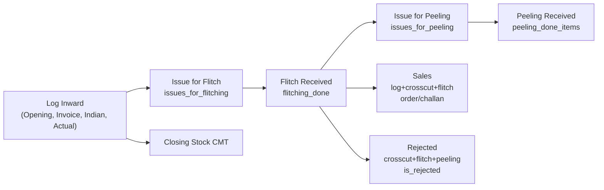

# Item Wise Flitch Report API

## Overview
The Item Wise Flitch Report API generates an Excel report tracking inventory movements by item
name over a specified date range. The report uses a **16-column layout** with grouped sections:
Round Log Detail CMT (Invoice, Indian, Actual), Flitch Details CMT (Issue, Received, Diff),
Slicing Details CMT (Issue, Received, Diff), Sales, Rejected, and Closing Stock CMT.

**Key Focus:** Inventory flow from log inward → flitching → slicing → sales/rejection.

## Endpoint
```
POST /api/V1/reports2/flitch/download-excel-item-wise-flitch-report
```

## Authentication
- Requires: `AuthMiddleware`
- Permission: Standard user authentication

## Request Body

### Required Parameters
```json
{
  "startDate": "2025-03-01",
  "endDate": "2025-03-31"
}
```

### Optional Parameters
```json
{
  "startDate": "2025-03-01",
  "endDate": "2025-03-31",
  "filter": {
    "item_name": "RED OAK"
  }
}
```

## Response

### Success Response (200 OK)
```json
{
  "statusCode": 200,
  "status": "success",
  "message": "Item wise flitch report generated successfully",
  "result": "http://localhost:5000/public/upload/reports/reports2/Flitch/Item-Wise-Flitch-Report-<timestamp>.xlsx"
}
```

### Error Responses

#### 400 Bad Request – Missing Parameters
```json
{
  "statusCode": 400,
  "status": "error",
  "message": "Start date and end date are required"
}
```

#### 400 Bad Request – Invalid Date Format
```json
{
  "statusCode": 400,
  "status": "error",
  "message": "Invalid date format. Use YYYY-MM-DD"
}
```

#### 400 Bad Request – Invalid Date Range
```json
{
  "statusCode": 400,
  "status": "error",
  "message": "Start date cannot be after end date"
}
```

#### 404 Not Found
```json
{
  "statusCode": 404,
  "status": "error",
  "message": "No inward data found for the selected period"
}
```

---

## Report Structure

### Row 1: Report Title
Merged across all 16 columns.

**Format:** `Inward Item Wise Report From DD/MM/YYYY to DD/MM/YYYY`

**With item filter:** `Inward Item Wise Report [ RED OAK ] From 01/03/2025 to 31/03/2025`

### Row 2: Empty (spacing)

### Row 3: Group Headers (merged cells)

| Columns | Group Label |
|---------|-------------|
| 3 – 5   | Round Log Detail CMT (Invoice, Indian, Actual) |
| 7 – 9   | Flitch Details CMT (Issue for Flitch, Flitch Received, Flitch Diff) |
| 10 – 12 | Slicing Details CMT (Issue for Slicing, Slicing Received, Slicing Diff) |
| 1, 2, 6, 13, 14, 15, 16 | Standalone (Item Name, Opening Stock, Recover From rejected, Issue for Sq.Edge, Sales, Rejected, Closing Stock CMT) |

### Row 4: Column Headers (16 columns, v4)

| # | Column | Description |
|---|--------|-------------|
| 1 | Item Name | Wood species (`item_name`) |
| 2 | Opening Stock CMT | `flitching_done` with `issue_status=null` before period |
| 3 | Invoice | LOG source: `invoice_cmt` in period; crosscut source: 0 |
| 4 | Indian | LOG source: `indian_cmt` in period; crosscut source: 0 |
| 5 | Actual | LOG: `physical_cmt`; crosscut: `crosscut_cmt` (period) |
| 6 | Recover From rejected | Placeholder – 0 (data source TBD) |
| 7 | Issue for Flitch | `issues_for_flitching` (`createdAt` in period) |
| 8 | Flitch Received | `flitching_done.flitch_cmt` in period, `deleted_at` null |
| 9 | Flitch Diff | `max(0, Issue for Flitch − Flitch Received)` |
| 10 | Issue for Slicing | `issued_for_slicing` (`createdAt` in period) |
| 11 | Slicing Received | `slicing_done_other_details.total_cmt` (`slicing_date` in period) |
| 12 | Slicing Diff | `max(0, Issue for Slicing − Slicing Received)` |
| 13 | Issue for Sq.Edge | Placeholder – 0 (data source TBD) |
| 14 | Sales | `flitching_done` with `issue_status` order/challan in period |
| 15 | Rejected | Flitch wastage (`wastage_info.wastage_sqm`) + slicing wastage (`issue_for_slicing_wastage.cmt`) in period |
| 16 | Closing Stock CMT | `max(0, Opening + Flitch Received − Issue for Slicing − Sales)` |

### Rows 5+: Data rows (one per item, sorted alphabetically)

### Last Row: Grand Total (bold, light gray background)

---

## Report Features

- **16 columns** with grouped header row (Round Log Detail CMT, Flitch Details CMT, Slicing Details CMT, Sales, Rejected, Closing Stock)
- **Item universe**: All items flitched in the period + all items with opening stock (issue_status=null created before period)
- **Sorted data**: items sorted alphabetically by name
- **Grand Total row**: sums numeric columns, bold with gray background (#FFE0E0E0)
- **Gray background**: group header and column header rows (#FFD3D3D3)
- **3 decimal precision**: all CMT values formatted to 3 decimal places
- **Item filter**: optional `filter.item_name` narrows the report to one species
- **Activity filter**: items with all-zero values are excluded

---

## Inventory Calculation Logic

All values are in **CMT (Cubic Meter)** and use the aggregation date filters specified below.

### Opening Stock CMT
```
Sum of flitch_cmt from flitching_done
WHERE worker_details.flitching_date < startDate
  AND issue_status IS NULL
  AND deleted_at IS NULL
```
*Represents inventory carried forward (not yet allocated to slicing/sales)*

### Invoice / Indian / Actual CMT (Round Log Detail)
**IF Log Source** (`crosscut_done_id IS NULL`):
```
Invoice CMT = Sum of log_inventory.invoice_cmt
Indian CMT = Sum of log_inventory.indian_cmt
Actual CMT = Sum of log_inventory.physical_cmt
WHERE worker_details.flitching_date IN [startDate, endDate]
```

**IF Crosscut Source** (`crosscut_done_id IS NOT NULL`):
```
Invoice CMT = 0 (hard-coded)
Indian CMT = 0 (hard-coded)
Actual CMT = Sum of crosscutting_done.crosscut_cmt
```

### Issue for Flitch
```
Sum of cmt from issues_for_flitching
WHERE createdAt IN [startDate, endDate]
```

### Flitch Received
```
Sum of flitch_cmt from flitching_done
WHERE worker_details.flitching_date IN [startDate, endDate]
  AND deleted_at IS NULL
```

### Flitch Diff
```
Flitch Diff = max(0, Issue for Flitch − Flitch Received)
```
Never negative in the Excel output (`nonNegativeDiff` in the controller).

### Issue for Slicing
```
Sum of cmt from issued_for_slicing
WHERE createdAt IN [startDate, endDate]
```

### Slicing Received
```
Sum of slicing_done_other_details.total_cmt
WHERE slicing_date IN [startDate, endDate]
  (joined to issued_for_slicing on issue_for_slicing_id)
```

### Slicing Diff
```
Slicing Diff = max(0, Issue for Slicing − Slicing Received)
```
Never negative in the Excel output.

### Sales
```
Sum of flitch_cmt from flitching_done
WHERE worker_details.flitching_date IN [startDate, endDate]
  AND issue_status IN ['order', 'challan']
  AND deleted_at IS NULL
```

### Rejected (Wastage)
```
Flitch Wastage:
  Sum of flitching_done.wastage_info.wastage_sqm
  WHERE worker_details.flitching_date IN [startDate, endDate]

+ Slicing Wastage:
  Sum of issue_for_slicing_wastage.cmt
  WHERE createdAt IN [startDate, endDate]
    (joined to issued_for_slicing on issue_for_slicing_id)
```

### Closing Stock CMT
```
Closing Stock = MAX(0,
  Opening Stock CMT
  + Flitch Received
  − Issue for Slicing
  − Sales
)
```
*Clamped to 0; no negative inventory values*

### Non-negative difference columns

**Flitch Diff** and **Slicing Diff** are issue-minus-received variances **floored at 0** (same rule as the Flitch Item Further Process report). Grand totals sum these columns across items.

### Placeholder Fields (always 0)
- **Recover From Rejected** – data source TBD
- **Issue for Sq.Edge** – data source TBD

### Placeholder fields (always 0)
- **Recover From rejected** – data source not yet defined
- **Issue for Sq.Edge** – data source not yet defined

---

## Data Flow



---

## Database Collections

| Collection | Model | Key Fields Used |
|------------|-------|-----------------|
| `log_inventory_items_details` | `log_inventory_items_model` | `physical_cmt`, `invoice_cmt`, `indian_cmt`, `issue_status`, `createdAt` |
| `log_inventory_invoice_details` | (lookup) | `inward_date` |
| `crosscutting_dones` | `crosscutting_done_model` | `crosscut_cmt`, `issue_status`, `is_rejected`, `createdAt` |
| `issued_for_flitchings` | `issues_for_flitching_model` | `cmt`, `item_name`, `createdAt` |
| `flitchings` | `flitching_done_model` | `flitch_cmt`, `issue_status`, `is_rejected`, `deleted_at`, `createdAt` |
| `issued_for_peelings` | `issues_for_peeling_model` | `cmt`, `item_name`, `createdAt` |
| `peeling_done_other_details` | `peeling_done_other_details_model` | `createdAt`, `is_rejected` |
| `peeling_done_items` | (lookup via `peeling_done_other_details_id`) | `item_name`, `cmt` |

---

## Example Request

### cURL
```bash
curl -X POST http://localhost:5000/api/V1/report/download-excel-item-wise-flitch-report \
  -H "Content-Type: application/json" \
  -H "Authorization: Bearer YOUR_TOKEN" \
  -d '{
    "startDate": "2025-03-01",
    "endDate": "2025-03-31"
  }'
```

### With Item Filter
```bash
curl -X POST http://localhost:5000/api/V1/report/download-excel-item-wise-flitch-report \
  -H "Content-Type: application/json" \
  -H "Authorization: Bearer YOUR_TOKEN" \
  -d '{
    "startDate": "2025-03-01",
    "endDate": "2025-03-31",
    "filter": {
      "item_name": "RED OAK"
    }
  }'
```

---

## File Information

**Generated File Name Format:**
```
Item-Wise-Flitch-Report-{timestamp}.xlsx
```

**Storage Location:**
```
public/upload/reports/reports2/Flitch/
```

**File Format:** Excel (.xlsx)

**Worksheet Name:** Item Wise Flitch Report

---

## Implementation Files

| Purpose | Path |
|---------|------|
| Controller | `topl_backend/controllers/reports2/Flitch/itemWiseFlitch.js` |
| Excel Generator | `topl_backend/config/downloadExcel/reports2/Flitch/itemWiseFlitch.js` |
| Route | `topl_backend/routes/report/reports2/Flitch/flitch.routes.js` |

**Route:** `POST /api/V1/report/download-excel-item-wise-flitch-report`

---

## Notes

1. **Date Format:** All dates in `YYYY-MM-DD` format.
2. **Deleted Records:** Flitch aggregations filter `deleted_at IS NULL`.
3. **Activity Filter:** Items where all numeric columns are zero are excluded.
4. **End Date Inclusive:** End date includes full day up to 23:59:59.999.
5. **Decimal Precision:** All CMT values formatted to 3 decimal places.
6. **Sorting:** Results sorted alphabetically by item name.
7. **Placeholder columns:** Recover From rejected and Issue for Sq.Edge always output 0 until a data source is defined by the client.
8. **Item universe:** Unique `item_name` values from items **inwarded in the date range** – union of log inward (`log_inventory_items` + `log_inventory_invoice_details.inward_date`) and flitch inward (`flitch_inventory_items` + `flitch_inventory_invoice_details.inward_date`).
9. **v4 layout:** Cross Cut columns were removed; round-log actuals still use crosscut data where the flitch source is crosscut (`crosscut_done_id`).

---

## Version History

| Version | Date | Changes |
|---------|------|---------|
| 1.0.0 | 2025-02-03 | Initial implementation (7 columns) |
| 2.0.0 | 2026-03-06 | Expanded to 21 columns (Round Log, Cross Cut, Flitch, Peeling) |
| 3.0.0 | 2026-03-06 | 20 columns (removed Job Work Challan) |
| 4.0.0 | 2026-03-20 | **16 columns; Peeling→Slicing; Fixed Opening/Closing formulas; Wastage aggregation** |

**v4 Key Changes:**
- Opening Stock now represents inventory NOT yet allocated (issue_status=null, created before period)
- Closing Stock formula changed to reflect actual flow: Opening + Received − Issued − Sales
- Peeling replaced with Slicing factory tracking
- Flitch wastage now uses wastage_info.wastage_sqm; slicing wastage added
- Round Log Detail CMT intelligently sources from LOG or CROSSCUT based on issue origin
- Cross Cut section removed (10 columns)
- Focus shifted from transaction tracking to inventory-flow visibility

---

## Related Resources

- Implementation Plan: [ITEM_WISE_FLITCH_PLAN.md](ITEM_WISE_FLITCH_PLAN.md)
- Controller: [itemWiseFlitch.js](../../../../controllers/reports2/Flitch/itemWiseFlitch.js)
- Excel Config: [itemWiseFlitch.js](../../../../config/downloadExcel/reports2/Flitch/itemWiseFlitch.js)
- Route: [flitch.routes.js](../../../../routes/report/reports2/Flitch/flitch.routes.js)
