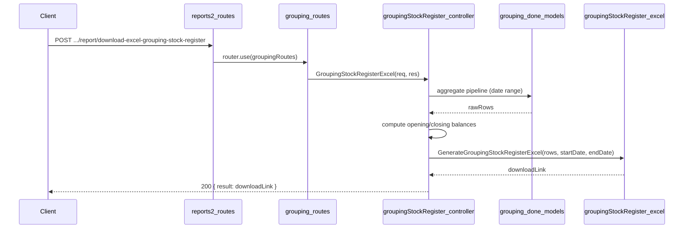

# Grouping Stock Register API — Implementation Plan

**Overview:** Add a Grouping Stock Register API under reports2 > Grouping > Stock_Register that produces a date-wise Excel stock register in sheets (no_of_sheets). One row per unique (item_sub_category_name, item_name, grouping_done_date, log_no_code, thickness). Columns: Item Group Name, Sales Item Name, Grouping Date, Log X, Thickness, Opening Balance, Grouping Done, Issue for tapping, Issue for Challan, Issue Sales, Damage, Closing Balance. Total row at bottom with yellow fill.

---

## Report layout

- **Title:** `Grouping Item Stock Register Date wise between DD/MM/YYYY and DD/MM/YYYY`
- **12 columns (single header row):** Item Group Name | Sales Item Name | Grouping Date | Log X | Thickness | Opening Balance | Grouping Done | Issue for tapping | Issue for Challan | Issue Sales | Damage | Closing Balance
- **Header styling:** Gray fill, bold.
- **Total row:** Yellow fill, bold; sums all numeric columns.

## Data source (schema)

- **grouping_done_details** (`grouping_done_date`, `_id`)
  — Provides the grouping date. Filtered to [startDate, endDate].

- **grouping_done_items_details** (`grouping_done_other_details_id`, `item_sub_category_name`, `item_name`, `log_no_code`, `thickness`, `no_of_sheets`, `available_details.no_of_sheets`, `is_damaged`, `updatedAt`)
  — Primary item data. Joined via `grouping_done_other_details_id` → `grouping_done_details._id`.

- **grouping_done_history** (`grouping_done_item_id`, `issue_status`, `no_of_sheets`)
  — Issue records. Joined via `grouping_done_item_id` → `grouping_done_items_details._id`.
  - `issue_status = 'tapping'` → Issue for tapping
  - `issue_status = 'challan'` → Issue for Challan
  - `issue_status = 'order'`   → Issue Sales

## API contract

- **Endpoint:** `POST /api/v1/report/download-excel-grouping-stock-register`
- **Request body:** `{ "startDate": "YYYY-MM-DD", "endDate": "YYYY-MM-DD" }`
- **Success (200):** `{ result: "<APP_URL>/public/reports/Grouping/grouping_stock_register_<ts>.xlsx", statusCode: 200, ... }`
- **Errors:** 400 if startDate/endDate missing, invalid format, or start > end; 404 if no items found.

## File structure

| Purpose         | Path |
| --------------- | ---- |
| Controller      | `controllers/reports2/Grouping/Stock_Register/groupingStockRegister.js` |
| Excel generator | `config/downloadExcel/reports2/Grouping/Stock_Register/groupingStockRegister.js` |
| Routes          | `routes/report/reports2/Grouping/grouping.routes.js` (route added to existing file) |

## Implementation steps

### 1. Controller — `controllers/reports2/Grouping/Stock_Register/groupingStockRegister.js`

- Validate `startDate`, `endDate` (required; valid dates; start ≤ end).
- Set `end.setHours(23, 59, 59, 999)` for inclusive end date.
- Run a single MongoDB aggregation pipeline on **grouping_done_details**:
  1. `$match`: `grouping_done_date ∈ [start, end]`
  2. `$lookup`: join `grouping_done_items_details` via `_id` → `grouping_done_other_details_id`
  3. `$unwind`: items
  4. `$lookup`: join `grouping_done_history` via `items._id` → `grouping_done_item_id`
  5. `$addFields`: compute `item_issue_tapping`, `item_issue_challan`, `item_issue_sales` using `$filter` + `$sum` over history array.
  6. `$group` by `(items.item_sub_category_name, items.item_name, grouping_done_date, items.log_no_code, items.thickness)`:
     - `grouping_done`: `$sum items.no_of_sheets`
     - `current_available`: `$sum items.available_details.no_of_sheets`
     - `damage`: `$sum` of `items.no_of_sheets` where `items.is_damaged = true`
     - `issue_tapping`, `issue_challan`, `issue_sales`: sums of addField values
  7. `$sort`: item_sub_category_name, item_name, grouping_done_date, log_no_code
- Compute balances in JavaScript after aggregation:
  ```
  issued_in_period = issue_tapping + issue_challan + issue_sales
  opening_balance  = current_available + issued_in_period − grouping_done
  closing_balance  = opening_balance + grouping_done − issue_tapping − issue_challan − issue_sales − damage
  ```
- If no rows: 404. Otherwise call Excel generator; return 200 with link.

### 2. Excel config — `config/downloadExcel/reports2/Grouping/Stock_Register/groupingStockRegister.js`

- Export `GenerateGroupingStockRegisterExcel(rows, startDate, endDate)`.
- Use ExcelJS.
- **Title row:** merged across 12 cols; `Grouping Item Stock Register Date wise between <start> and <end>`.
- **Blank row** after title.
- **Header row:** 12 columns; gray fill (`FFD3D3D3`); bold; centered; thin border.
- **Data rows:** one per entry in `rows`; Grouping Date formatted DD/MM/YYYY; numeric cols (5–12) formatted `0.00`; all cells bordered.
- **Total row:** yellow fill (`FFFFD700`); bold; sums cols 6–12; cols 2–5 blank; all cells bordered.
- Output to `public/reports/Grouping/grouping_stock_register_{timestamp}.xlsx`.

### 3. Routes — `routes/report/reports2/Grouping/grouping.routes.js` (existing file)

Add:
```javascript
import { GroupingStockRegisterExcel } from '../../../../controllers/reports2/Grouping/Stock_Register/groupingStockRegister.js';
router.post('/download-excel-grouping-stock-register', GroupingStockRegisterExcel);
```

No change to `reports2.routes.js` — `groupingRoutes` is already mounted.

## Balance formula (rationale)

`current_available` represents what is currently on hand (after all activity up to now).
Reversing the period's activity gives us the opening stock at the start of the period:

```
Opening = current_available + (what left during period) − (what arrived during period)
        = current_available + issued_in_period         − grouping_done
```

Closing is then:
```
Closing = Opening + Grouping Done − Issues − Damage
```

Negative balances are allowed (consistent with the existing Grouping_Splicing stock register).

## Flow summary



## Notes

- **Units:** All quantities are in **sheets (no_of_sheets)**, not SQM. This differs from the Grouping_Splicing stock register which uses SQM.
- **Row granularity:** Per (item_sub_category_name, item_name, grouping_done_date, log_no_code, thickness) — "date wise" detail vs. the Grouping_Splicing register which aggregates per (item_sub_category_name, item_name) only.
- **No filter option:** Unlike the Grouping_Splicing stock register, no optional `filter.item_name` or `filter.item_group_name` is implemented (can be added in future if required).
- **History matching:** History records are matched to items via `grouping_done_item_id` (= `grouping_done_items_details._id`). This is a direct item-level link, more precise than the name-based match used in the Grouping_Splicing stock register.
