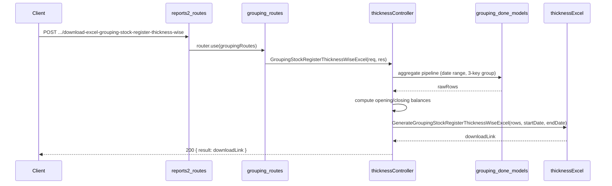

# Grouping Stock Register Thickness Wise API — Implementation Plan

**Overview:** Add a Grouping Stock Register Thickness Wise API under reports2 > Grouping that produces a thickness-wise stock register in sheets (no_of_sheets). One row per unique (item_sub_category_name, item_name, thickness). Columns: Item Group Name, Sales Item Name, Thickness, Opening Balance, Grouping Done, Issue for tapping, Issue for Challan, Issue Sales, Damage, Closing Balance. Yellow Total row at bottom.

This is a simplified variant of the already-built date-wise stock register (`groupingStockRegister.js`), differing only in row granularity: the date and log_no_code dimensions are removed from the group key.

---

## Report layout

- **Title:** `Grouping Item Stock Register Thickness Wise between DD/MM/YYYY and DD/MM/YYYY`
- **10 columns (single header row):** Item Group Name | Sales Item Name | Thickness | Opening Balance | Grouping Done | Issue for tapping | Issue for Challan | Issue Sales | Damage | Closing Balance
- **Header styling:** Gray fill (`FFD3D3D3`), bold, centered.
- **Total row:** Yellow fill (`FFFFD700`), bold; sums all numeric columns.

## Comparison with date-wise register

| Property      | Date-wise (`groupingStockRegister.js`)                            | Thickness-wise (this file)              |
|---------------|-------------------------------------------------------------------|-----------------------------------------|
| Columns       | 12 (includes Grouping Date col 3, Log X col 4)                    | 10 (no Grouping Date, no Log X)         |
| Group key     | (item_sub_category_name, item_name, grouping_done_date, log_no_code, thickness) | (item_sub_category_name, item_name, thickness) |
| Sort order    | sub_category → name → date → log                                  | sub_category → name → thickness         |
| Data sources  | Same 3 collections                                                | Same 3 collections                      |
| Balance logic | Identical                                                         | Identical                               |

## Data source (schema)

- **grouping_done_details** (`grouping_done_date`, `_id`) — filters sessions to [startDate, endDate].
- **grouping_done_items_details** (`grouping_done_other_details_id`, `item_sub_category_name`, `item_name`, `thickness`, `no_of_sheets`, `available_details.no_of_sheets`, `is_damaged`)
- **grouping_done_history** (`grouping_done_item_id`, `issue_status`, `no_of_sheets`)
  - `'tapping'` → Issue for tapping
  - `'challan'` → Issue for Challan
  - `'order'`   → Issue Sales

## API contract

- **Endpoint:** `POST /api/v1/report/download-excel-grouping-stock-register-thickness-wise`
- **Request body:** `{ "startDate": "YYYY-MM-DD", "endDate": "YYYY-MM-DD" }`
- **Success (200):** `{ result: "<APP_URL>/public/reports/Grouping/grouping_stock_register_thickness_wise_<ts>.xlsx", statusCode: 200, ... }`
- **Errors:** 400 if startDate/endDate missing, invalid format, or start > end; 404 if no items found.

## File structure

| Purpose         | Path |
| --------------- | ---- |
| Controller      | `controllers/reports2/Grouping/Stock_Register/groupingStockRegisterThicknessWise.js` |
| Excel generator | `config/downloadExcel/reports2/Grouping/Stock_Register/groupingStockRegisterThicknessWise.js` |
| Routes          | `routes/report/reports2/Grouping/grouping.routes.js` (route added to existing file) |

## Implementation steps

### 1. Controller — `groupingStockRegisterThicknessWise.js`

Identical aggregation pipeline to the date-wise register except Stage 5 `$group` uses only 3 keys:

```javascript
_id: {
  item_sub_category_name: '$items.item_sub_category_name',
  item_name: '$items.item_name',
  thickness: '$items.thickness',
}
```

Sort stage uses:
```javascript
{ $sort: { '_id.item_sub_category_name': 1, '_id.item_name': 1, '_id.thickness': 1 } }
```

Balance computations in JS after aggregation — identical formula:
```
issued_in_period = issue_tapping + issue_challan + issue_sales
opening_balance  = current_available + issued_in_period − grouping_done
closing_balance  = opening_balance + grouping_done − issue_tapping − issue_challan − issue_sales − damage
```

Output shape per row:
```javascript
{ item_group_name, item_name, thickness, opening_balance, grouping_done,
  issue_tapping, issue_challan, issue_sales, damage, closing_balance }
```

### 2. Excel config — `groupingStockRegisterThicknessWise.js`

- Export `GenerateGroupingStockRegisterThicknessWiseExcel(rows, startDate, endDate)`.
- 10 columns (no Grouping Date, no Log X vs. date-wise).
- Title: `Grouping Item Stock Register Thickness Wise between <start> and <end>`.
- Gray header row; yellow Total row; 0.00 numeric format on cols 3–10; thin borders throughout.
- Output: `public/reports/Grouping/grouping_stock_register_thickness_wise_{timestamp}.xlsx`.

### 3. Routes — `routes/report/reports2/Grouping/grouping.routes.js` (existing file)

Added:
```javascript
import { GroupingStockRegisterThicknessWiseExcel } from '../../../../controllers/reports2/Grouping/Stock_Register/groupingStockRegisterThicknessWise.js';
router.post('/download-excel-grouping-stock-register-thickness-wise', GroupingStockRegisterThicknessWiseExcel);
```

No change to `reports2.routes.js` — `groupingRoutes` is already mounted.

## Balance formula (rationale)

Same as date-wise register. `current_available = available_details.no_of_sheets` (current on-hand). Reversing period activity yields opening balance:

```
Opening = current_available + issued_in_period − grouping_done
Closing = Opening + grouping_done − issues − damage
```

Negative balances are allowed.

## Flow summary



## Notes

- **Units:** All quantities in **sheets (no_of_sheets)**, not SQM.
- **No filter option:** No optional item_name/item_group_name filter (can be added later if needed).
- **History matching:** Via `grouping_done_item_id` → `grouping_done_items_details._id` — direct item-level link.
- **Relation to date-wise register:** Same pipeline, same formulas, same collections. Only the `$group` key and output columns differ.
