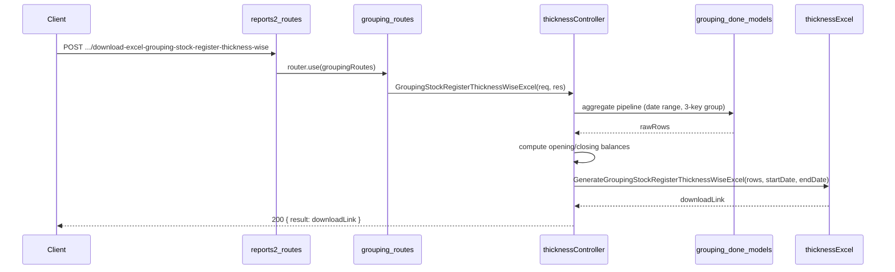

# Grouping Stock Register Thickness Wise API — Implementation Plan

**Overview:** Add a Grouping Stock Register Thickness Wise API under reports2 > Grouping that produces a thickness-wise stock register in **sheets and SQM**. One row per unique (item_sub_category_name, item_name, thickness). Each quantity is shown in **two columns: (Sheets)** and **(SQM)** (pair layout) — 17 columns total. A **Total** row (gray fill, bold) appears at the bottom.

This is a simplified variant of the already-built date-wise stock register (`groupingStockRegister.js`), differing only in row granularity: the date and log_no_code dimensions are removed from the group key.

---

## Report layout

- **Title:** `Grouping Item Stock Register Thickness Wise between DD/MM/YYYY and DD/MM/YYYY`
- **17 columns, two-level header:** Row 1 (super-header): Item Group Name | Sales Item Name | Thickness | Opening Balance (merged 2 cols) | Grouping Done (merged) | Issue for tapping (merged) | Issue for Challan (merged) | Issue Sales (merged) | Damage (merged) | Closing Balance (merged). Row 2 (sub-header): cols 1–3 blank; cols 4–17 = "Sheets" and "SQM" repeated for each quantity.
- **Header styling:** Gray fill (`FFD3D3D3`), bold, centered; both header rows.
- **Total row:** Gray fill, bold; sums all numeric columns (cols 4–17).

## Comparison with date-wise register

| Property      | Date-wise (`groupingStockRegister.js`)                            | Thickness-wise (this file)              |
|---------------|-------------------------------------------------------------------|-----------------------------------------|
| Columns       | 19 (includes Grouping Date, Log X; each quantity in Sheets + SQM) | 17 (no Grouping Date, no Log X; each quantity in Sheets + SQM) |
| Group key     | (item_sub_category_name, item_name, grouping_done_date, log_no_code, thickness) | (item_sub_category_name, item_name, thickness) |
| Sort order    | sub_category → name → date → log                                  | sub_category → name → thickness         |
| Data sources  | Same 3 collections                                                | Same 3 collections                      |
| Balance logic | Identical (Sheets + SQM)                                          | Identical (Sheets + SQM)                |

## Data source (schema)

- **grouping_done_details** (`grouping_done_date`, `_id`) — filters sessions to [startDate, endDate].
- **grouping_done_items_details** (`grouping_done_other_details_id`, `item_sub_category_name`, `item_name`, `thickness`, `no_of_sheets`, `sqm`, `available_details.no_of_sheets`, `available_details.sqm`, `is_damaged`)
- **grouping_done_history** (`grouping_done_item_id`, `issue_status`, `no_of_sheets`, `sqm`)
  - `'tapping'` → Issue for tapping
  - `'challan'` → Issue for Challan
  - `'order'`   → Issue Sales

## API contract

- **Endpoint:** `POST /api/v1/report/download-excel-grouping-stock-register-thickness-wise`
- **Request body:** `{ "startDate": "YYYY-MM-DD", "endDate": "YYYY-MM-DD" }`
- **Success (200):** `{ result: "<APP_URL>/public/reports/Grouping/grouping_stock_register_thickness_wise_<ts>.xlsx", statusCode: 200, ... }`
- **Errors:** 400 if startDate/endDate missing, invalid format, or start > end; 404 if no items found.

## File structure

| Purpose         | Path |
| --------------- | ---- |
| Controller      | `controllers/reports2/Grouping/Stock_Register/groupingStockRegisterThicknessWise.js` |
| Excel generator | `config/downloadExcel/reports2/Grouping/Stock_Register/groupingStockRegisterThicknessWise.js` |
| Routes          | `routes/report/reports2/Grouping/grouping.routes.js` (route added to existing file) |

## Implementation steps

### 1. Controller — `groupingStockRegisterThicknessWise.js`

Identical aggregation pipeline to the date-wise register (including SQM in `$addFields` and `$group`) except Stage 5 `$group` uses only 3 keys:

```javascript
_id: {
  item_sub_category_name: '$items.item_sub_category_name',
  item_name: '$items.item_name',
  thickness: '$items.thickness',
}
```

Accumulate both sheets and SQM: `grouping_done`, `grouping_done_sqm`, `current_available`, `current_available_sqm`, `damage`, `damage_sqm`, `issue_tapping`, `issue_tapping_sqm`, `issue_challan`, `issue_challan_sqm`, `issue_sales`, `issue_sales_sqm`.

Sort stage uses:
```javascript
{ $sort: { '_id.item_sub_category_name': 1, '_id.item_name': 1, '_id.thickness': 1 } }
```

Balance computations in JS after aggregation (sheets + SQM):
```
issued_in_period = issue_tapping + issue_challan + issue_sales
issued_in_period_sqm = issue_tapping_sqm + issue_challan_sqm + issue_sales_sqm
opening_balance  = current_available + issued_in_period − grouping_done
opening_balance_sqm = current_available_sqm + issued_in_period_sqm − grouping_done_sqm
closing_balance  = opening_balance + grouping_done − issue_tapping − issue_challan − issue_sales − damage
closing_balance_sqm = opening_balance_sqm + grouping_done_sqm − issue_tapping_sqm − issue_challan_sqm − issue_sales_sqm − damage_sqm
```

Output shape per row includes all `*_sqm` fields (opening_balance_sqm, grouping_done_sqm, issue_*_sqm, damage_sqm, closing_balance_sqm).

### 2. Excel config — `groupingStockRegisterThicknessWise.js`

- Export `GenerateGroupingStockRegisterThicknessWiseExcel(rows, startDate, endDate)`.
- 17 columns: 3 key cols + 7 quantity pairs (Sheets, SQM). Two-level header: super-header with quantity names merged over 2 cols; sub-header with "Sheets" and "SQM".
- Title: `Grouping Item Stock Register Thickness Wise between <start> and <end>` (merged across 17 cols).
- Gray header rows (both levels); gray Total row; 0.00 numeric format on cols 3–17; thin borders throughout.
- Output: `public/reports/Grouping/grouping_stock_register_thickness_wise_{timestamp}.xlsx`.

### 3. Routes — `routes/report/reports2/Grouping/grouping.routes.js` (existing file)

Added:
```javascript
import { GroupingStockRegisterThicknessWiseExcel } from '../../../../controllers/reports2/Grouping/Stock_Register/groupingStockRegisterThicknessWise.js';
router.post('/download-excel-grouping-stock-register-thickness-wise', GroupingStockRegisterThicknessWiseExcel);
```

No change to `reports2.routes.js` — `groupingRoutes` is already mounted.

## Balance formula (rationale)

Same as date-wise register (Sheets + SQM). `current_available` / `current_available_sqm` from `available_details`. Reversing period activity yields opening balance (and opening_balance_sqm). Closing same logic. Negative balances are allowed.

## Flow summary



## Notes

- **Units:** Quantities shown in **both sheets (no_of_sheets) and SQM**, in paired columns (Sheets then SQM). Headers use "(Sheets)" and "(SQM)" in the sub-header row.
- **No filter option:** No optional item_name/item_group_name filter (can be added later if needed).
- **History matching:** Via `grouping_done_item_id` → `grouping_done_items_details._id` — direct item-level link.
- **Relation to date-wise register:** Same pipeline, same formulas, same collections. Only the `$group` key and output columns differ.
