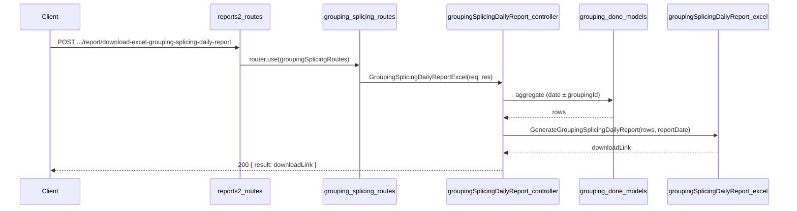

# Grouping/Splicing Daily Report API Plan

**Overview:** Add a Grouping/Splicing daily report API under reports2 > Grouping_Splicing that produces an Excel report with three sections: (1) main grouping details table grouped by Item Name with per-group and grand totals, (2) dimension and quantity summary by Length/Width, (3) grouping operations metadata (Grouping Id, Shift, Work Hours, Worker, Machine Id). Data is sourced from grouping_done_details and grouping_done_items_details, with lookup to users for worker name. Customer Name is not in grouping schema (left blank). Damaged Sheets from items.is_damaged.

---

## Report layout (from spec)

- **Title:** "Grouping Details Report Date: DD/MM/YYYY"
- **Section 1 – Main table:** Columns — Item Name, LogX, Length, Width, Sheets, Damaged Sheets, Sq Mtr, Customer Name, Character, Pattern, Series, Remarks. Rows grouped by Item Name; after each Item Name block a Total row (Sheets, Sq Mtr); Grand Total row at end.
- **Section 2 – Dimension summary:** Columns — Length, Width, Sheets, Damaged Sheets, SQ Mtr. One row per (Length, Width) with aggregated Sheets, Damaged Sheets and Sq Mtr; Total row at bottom.
- **Section 3 – Grouping operations:** Grouping Id, Shift, Work Hours, Worker, Machine Id. One row per grouping session. Machine Id not in schema (blank).

## Data source (schema)

- **grouping_done.schema.js** (`topl_backend/database/schema/factory/grouping/grouping_done.schema.js`)
  - **grouping_done_details:** `grouping_done_date`, `shift`, `no_of_working_hours`, `created_by`. Use `_id` as "Grouping Id". No Machine Id in schema.
  - **grouping_done_items_details:** `grouping_done_other_details_id`, `item_name`, `log_no_code` (→ LogX), `length`, `width`, `no_of_sheets`, `sqm`, `character_name`, `pattern_name`, `series_name`, `remark`, `is_damaged` (→ Damaged Sheets: 1 if true else 0).
- **Customer Name:** Not in grouping schema; report leaves blank.
- **Worker:** Resolve `created_by` via lookup to `users` (first_name, last_name).

## API contract

- **Endpoint:** `POST /api/v1/report/download-excel-grouping-splicing-daily-report`
- **Request body:** `{ "filters": { "reportDate": "YYYY-MM-DD" } }`  
  Optional: `groupingId` (ObjectId of grouping_done_details) to restrict to one session; if omitted, include all grouping sessions for that date.
- **Success (200):** `{ result: "<APP_URL>/public/reports/Grouping_Splicing/...", statusCode: 200, status: "success", message: "..." }`
- **Errors:** 400 if `reportDate` missing or invalid; 404 if no grouping data for the date (or for the given groupingId).

## File structure

| Purpose         | Path |
| --------------- | ----- |
| Controller      | `controllers/reports2/Grouping_Splicing/groupingSplicingDailyReport.js` |
| Excel generator | `config/downloadExcel/reports2/Grouping_Splicing/groupingSplicingDailyReport.js` |
| Routes          | `routes/report/reports2/Grouping_Splicing/grouping_splicing.routes.js` |
| Mount           | `routes/report/reports2.routes.js` — groupingSplicingRoutes mounted |

## Implementation steps

### 1. Controller — `controllers/reports2/Grouping_Splicing/groupingSplicingDailyReport.js`

- Use `catchAsync`, validate `reportDate` from `req.body.filters`; optionally validate `tappingId`.
- Date range: start-of-day to end-of-day for `reportDate`.
- Aggregation pipeline on **grouping_done_details**:
  - **$match:** `grouping_done_date` in range; if `groupingId` provided, also `_id: ObjectId(groupingId)`.
  - **$lookup** `grouping_done_items_details` on `_id` → `grouping_done_other_details_id`.
  - **$unwind** items.
  - **$lookup** `users` on `created_by` for worker name (first_name, last_name).
  - **$sort** by `item_name`, `log_no_code`, length, width.
  - **$project** flat fields: grouping_id, shift, no_of_working_hours, worker; item_name, log_no_code, length, width, no_of_sheets, sqm, character_name, pattern_name, series_name, remark, customer_name (literal ''); damaged_sheets = 1 if items.is_damaged else 0.
- If no documents: return 404. Otherwise call Excel generator with (rows, reportDate); return 200 with download link.

### 2. Excel config — `config/downloadExcel/reports2/Grouping_Splicing/groupingSplicingDailyReport.js`

- Export `GenerateGroupingSplicingDailyReport(rows, reportDate)`.
- Use ExcelJS; date format DD/MM/YYYY.
- **Sheet layout:**
  - Title: "Hand Splicing Details Report Date: &lt;formattedDate&gt;".
  - **Section 1:** Main table headers; one data row per item; after each Item Name group insert Total row (Sheets, Sq Mtr); then Grand Total row.
  - **Section 2:** Dimension summary headers; group aggregated rows by (Length, Width), sum Sheets, Damaged Sheets and Sq Mtr; Total row at bottom.
  - **Section 3:** Grouping operations headers; one row per unique grouping_id (Grouping Id, Shift, Work Hours, Worker, Machine Id blank).
- Styling: bold headers, gray fill, borders, numeric formats (0.00). Save to `public/reports/Grouping_Splicing/`; return APP_URL + filePath.

### 3. Routes — `routes/report/reports2/Grouping_Splicing/grouping_splicing.routes.js`

- Import `GroupingSplicingDailyReportExcel` and express.Router().
- Define: `router.post('/download-excel-grouping-splicing-daily-report', GroupingSplicingDailyReportExcel)`.
- Export default router.

### 4. Mount — `routes/report/reports2.routes.js`

- Import: `import groupingSplicingRoutes from './reports2/Grouping_Splicing/grouping_splicing.routes.js';`
- Add: `router.use(groupingSplicingRoutes);`

## Flow summary

## Notes

- **Customer Name:** Not in grouping schema; report leaves blank.
- **Damaged Sheets:** From `grouping_done_items_details.is_damaged` (1 if true, 0 if false).
- **Machine Id:** Not in grouping_done_details schema; report leaves blank.
