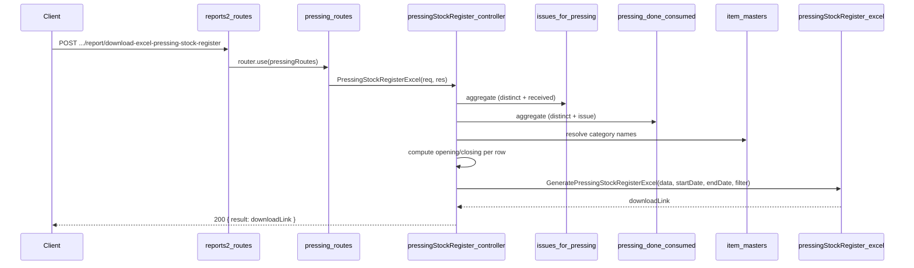

# Pressing Stock Register API Plan

**Overview:** Add a Pressing Item Stock Register report API under reports2 > Pressing that produces an Excel report matching the provided layout: date range, Category, Item Group, Item Name, OPBL SqMtr, Received SqMtr, Pur Sq Mtr, Issue SqMtr, Process Waste SqMtr, New Sqmtr, Closing SqMtr, with Item Group subtotal rows and a grand Total row at the end. Data is sourced from issues_for_pressing, pressing_done_consumed_items_details, pressing_done_details, and item masters (category).

---

## Goal

Implement a **Pressing Item Stock Register** report that matches the specified layout:

- **Title:** "Pressing Item Stock Register between DD/MM/YYYY and DD/MM/YYYY"
- **Columns:** Category | Item Group | Item Name | OPBL SqMtr | Received SqMtr | Pur Sq Mtr | Issue SqMtr | Process Waste SqMtr | New Sqmtr | Closing SqMtr
- **Grouping:** Rows grouped by Category, then Item Group, then Item Name. Merged cells for Category and Item Group where same.
- **Subtotals:** A "Total" row after each Item Group summing numeric columns for that group.
- **Grand total:** A final "Total" row at the end summing all numeric columns.

**Formulas:**

- Closing SqMtr = OPBL SqMtr + Received SqMtr + Pur Sq Mtr − Issue SqMtr (per row).
- New Sqmtr = Issue SqMtr − Process Waste SqMtr.

---

## Data source and schema

- **issues_for_pressing** (`topl_backend/database/schema/factory/pressing/issues_for_pressing/issues_for_pressing.schema.js`)
  - Items issued from tapping/splicing to pressing.
  - Key fields: `item_name`, `item_sub_category_name`, `item_name_id`, `sqm`, `available_details.sqm`, `is_pressing_done`, `createdAt`.
  - **Received in period**: sum(sqm) where createdAt ∈ [startDate, endDate].
  - **Current available**: sum(available_details.sqm) where is_pressing_done = false (for opening balance).

- **pressing_done_consumed_items_details** (`topl_backend/database/schema/factory/pressing/pressing_done/pressing_done.schema.js`)
  - One document per pressing run; linked by `pressing_done_details_id`.
  - **base_details[]**: base_type (PLYWOOD, MDF, FLEECE_PAPER), item_name, item_sub_category_name, sqm. Category = display map from base_type.
  - **group_details[]**: item_name, item_sub_category_name, sqm. Category from item_name_id → item_category.
  - **Issue in period**: Join to pressing_done_details by pressing_done_details_id; filter pressing_date ∈ [start, end]; sum base_details.sqm + group_details.sqm by (category, item_group, item_name).

- **pressing_done_details**
  - Key fields: `_id`, `pressing_date`. Used only to filter consumption by date.

- **item_name** (masters): `category` (ref item_category). Used to resolve Category for issues_for_pressing and group_details.
- **item_category** (masters): `category` (string). Display name for Category column.

**Mapping to report columns:**

| Report column       | Source / logic |
|---------------------|----------------|
| Category            | From item_name → item_category for issues/group_details; from base_type map (Plywood, Decorative Mdf, Craft Back Paper) for base_details |
| Item Group          | item_sub_category_name |
| Item Name           | item_name |
| OPBL SqMtr          | Current available + Issue in period − Received in period |
| Received SqMtr      | Sum sqm from issues_for_pressing where createdAt in [start, end] |
| Pur Sq Mtr          | No schema → 0 |
| Issue SqMtr         | Sum sqm from pressing_done_consumed_items_details (base + group) where pressing_done_details.pressing_date in [start, end] |
| Process Waste SqMtr | Per-item not in schema → 0 |
| New Sqmtr           | Issue SqMtr − Process Waste SqMtr |
| Closing SqMtr       | OPBL + Received + Pur − Issue |

---

## API contract

- **Endpoint:** `POST /api/V1/report/download-excel-pressing-stock-register`
- **Request body:** `{ startDate, endDate, filter?: { item_name?, item_group_name? } }` (same style as Dressing/Grouping Stock Register).
- **Success (200):** `{ result: "<APP_URL>/public/upload/reports/reports2/Pressing/Pressing-Stock-Register-<timestamp>.xlsx", statusCode: 200, message: "Pressing stock register generated successfully" }`
- **Errors:** 400 if startDate/endDate missing or invalid or start > end; 404 when no distinct items or all rows filtered out as zero.

---

## File and route layout

| Purpose         | Path |
|-----------------|------|
| Controller      | `controllers/reports2/Pressing/pressingStockRegister.js` |
| Excel generator | `config/downloadExcel/reports2/Pressing/pressingStockRegister.js` |
| Routes          | `routes/report/reports2/Pressing/pressing.routes.js` |
| Mount           | `routes/report/reports2.routes.js` — pressing router already mounted |

Reference patterns:

- **Controller + balance logic:** `groupingSplicingStockRegister.js`, `dressingStockRegister.js` (distinct items, per-row aggregates, opening/closing formulas, then call Excel generator).
- **Excel structure:** `groupingSplicingStockRegister.js` (title with date range, header row, data rows, subtotal rows per group, grand total row, merged cells, gray header/total style).

---

## Implementation steps (as implemented)

### 1. Controller — `pressingStockRegister.js`

- Validate `startDate` and `endDate` (required, valid format, start ≤ end).
- Optional filter by `item_name` and/or `item_group_name` (match item_sub_category_name).
- Get distinct (Category, Item Group, Item Name):
  - From issues_for_pressing (with category lookup via item_name_id → item_name → item_category).
  - From pressing_done_consumed_items_details base_details (category = BASE_TYPE_MAP[base_type]).
  - From pressing_done_consumed_items_details group_details (category from item master). Merge and dedupe.
- For each triple: compute received (issues_for_pressing created in period), purchase (0), issue (consumption from base_details + group_details where pressing_date in range), process_waste (0), new_sqmtr = issue − process_waste, opening (current available + issue − received), closing = opening + received + purchase − issue.
- Filter to “active” rows (any non-zero metric or closing).
- Call `GeneratePressingStockRegisterExcel(activeStockData, startDate, endDate, filter)` and return download link (ApiResponse).

### 2. Excel config — `pressingStockRegister.js`

- Folder: `public/upload/reports/reports2/Pressing`.
- Title: "Pressing Item Stock Register between {start} and {end}" (DD/MM/YYYY).
- Headers: Category, Item Group, Item Name, OPBL SqMtr, Received SqMtr, Pur Sq Mtr, Issue SqMtr, Process Waste SqMtr, New Sqmtr, Closing SqMtr.
- Sort data by category, then item_group_name, then item_name. Write detail rows; when item_group changes, insert a “Total” row for that group (sum of numeric cols). Merge cells for Category and Item Group for same group. At the end, add one grand total row. Apply number format 0.00 for numeric cells; bold/grey fill for header and total rows.

### 3. Routes — `pressing.routes.js`

- Import `PressingStockRegisterExcel` from the controller.
- Define: `router.post('/download-excel-pressing-stock-register', PressingStockRegisterExcel)`.
- Export default router.

### 4. Mount

- Pressing routes are already imported and used in `reports2.routes.js`; no change required for stock register (same router).

---

## Flow summary

---

## Clarifications and assumptions

- **Category for base_details:** Display names: MDF → "Decorative Mdf", FLEECE_PAPER → "Craft Back Paper", PLYWOOD → "Plywood".
- **Received for base materials:** Base materials (MDF, Plywood, Fleece) are consumed from inventory; they do not appear in issues_for_pressing. Their “received” in pressing is 0 in this report; only splicing-issued items have received from issues_for_pressing.
- **Opening for base-only items:** Current available for such items is 0 (no stock in pressing); opening = 0 + issue − 0 = issue; closing = 0 + 0 − issue = −issue (can be negative) or we still show them for visibility.
- **Process Waste:** pressing_damage has sqm but no item-level breakdown; per-item process waste is 0 in current implementation.
- **Location:** All code under reports2/Pressing (controller, config, routes).

---

## Optional later enhancements

- Support filter by `category` (e.g. filter by Category name).
- If Process Waste is attributed to items (e.g. via pressing_damage linked to item), add aggregate and wire into Process Waste SqMtr column.
- If Purchase or other inward for pressing items gets a schema, add aggregates and wire into Pur Sq Mtr.
