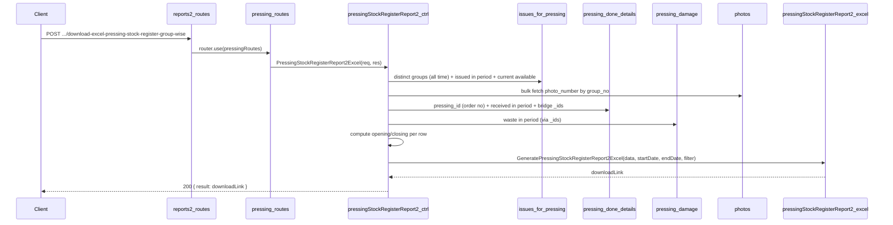

# Pressing Stock Register Report 2 — Plan

## Group No Wise

**Overview:** Add a Pressing Item Stock Register (Report 2) API under reports2 > Pressing that produces an Excel report at transaction (group) level — one row per distinct `(group_no, item_name)`, grouped and subtotalled by Item Name. Columns include Group no, Photo No, Order No, Issued Thickness, Received Thickness, Size, Opening SqMtr, Issued for pressing SqMtr, Pressing received Sqmtr, Pressing Waste SqMtr, and Closing SqMtr. Data is sourced from `issues_for_pressing`, `pressing_done_details`, `pressing_damage`, and `photos`.

---

## Goal

Implement a **Pressing Item Stock Register — Group No Wise** report matching the specified layout:

- **Title:** `"Pressing Item Stock Register between group no wise DD/MM/YYYY and DD/MM/YYYY"`
- **Columns (12):** Item Name | Group no | Photo No | Order No | Issued Thickness | Received Thickness | Size | Opening SqMtr | Issued for pressing SqMtr | Pressing received Sqmtr | Pressing Waste SqMtr | Closing SqMtr
- **Single header row.**
- **Grouping:** One row per distinct `(group_no, item_name)`. Rows grouped by Item Name with merged Item Name cells.
- **Subtotals:** A "Total" row after each Item Name group summing all numeric columns.
- **Grand total:** A final "Total" row at the end summing all numeric columns.

**Formulas:**

```
current_available  = sum(issues_for_pressing.available_details.sqm) where is_pressing_done = false

Opening SqMtr      = current_available + pressing_received + pressing_waste − issued_for_pressing

Closing SqMtr      = current_available
                   (algebraically = Opening + issued_for_pressing − pressing_received − pressing_waste)
```

---

## Data source and schema

- **issues_for_pressing** (`topl_backend/database/schema/factory/pressing/issues_for_pressing/issues_for_pressing.schema.js`)
  - Items issued from tapping/splicing to pressing.
  - Key fields: `group_no`, `item_name`, `thickness`, `length`, `width`, `sqm`, `available_details.sqm`, `is_pressing_done`, `createdAt`.
  - **Distinct rows:** Group by `(group_no, item_name)` all time, keep `$first` of thickness, length, width. Sort by item_name asc, group_no asc.
  - **Issued in period:** sum(sqm) where createdAt ∈ [start, end], per `(group_no, item_name)`.
  - **Current available:** sum(available_details.sqm) where is_pressing_done = false, per `(group_no, item_name)`.
- **pressing_done_details** (`topl_backend/database/schema/factory/pressing/pressing_done/pressing_done.schema.js`)
  - One document per pressing run.
  - Key fields: `_id`, `group_no`, `order_id`, `issued_for`, `sqm`, `pressing_date`.
  - **Order No:** When issued_for=ORDER, get order_id → lookup orders.order_no. Empty when issued_for is STOCK or SAMPLE.
  - **Pressing received:** sum(sqm) per group_no where pressing_date ∈ [start, end].
  - **Bridge for waste:** fetch `_id` + `group_no` for docs with pressing_date in range.
- **orders** (`topl_backend/database/schema/order/orders.schema.js`)
  - Key fields: `_id`, `order_no`.
  - Used for: Order No column when pressing_done_details.issued_for = ORDER.
- **pressing_damage** (`topl_backend/database/schema/factory/pressing/pressing_damage/pressing_damage.schema.js`)
  - Key fields: `pressing_done_details_id`, `sqm`.
  - **Pressing Waste:** sum(sqm) per pressing_done_details_id; map back to group_no via bridge.
- **photos** (`topl_backend/database/schema/masters/photo.schema.js`)
  - Key fields: `group_no`, `photo_number`, `hybrid_group_no`.
  - Used to resolve `photo_number` per group_no. For hybrid veneer, groups in `hybrid_group_no.group_no` also map to the same `photo_number` (single bulk query with `$or` on group_no and hybrid_group_no.group_no).

**Mapping to report columns:**


| Report column             | Source / logic                                                               |
| ------------------------- | ---------------------------------------------------------------------------- |
| Item Name                 | issues_for_pressing.item_name                                                |
| Group no                  | issues_for_pressing.group_no                                                 |
| Photo No                  | photos.photo_number via group_no or hybrid_group_no.group_no                 |
| Order No                  | orders.order_no when pressing_done_details.issued_for = ORDER, else empty   |
| Issued Thickness          | issues_for_pressing.thickness when dimKey matches; else pressing_done_consumed_items_details.group_details.thickness |
| Received Thickness        | pressing_done_details.thickness (pressed output)                             |
| Size                      | `length X width` (string)                                                    |
| Opening SqMtr             | current_available + pressing_received + pressing_waste − issued_for_pressing |
| Issued for pressing SqMtr | issues_for_pressing.sqm where createdAt in [start, end], per (group_no, thickness, length, width) |
| Pressing received Sqmtr   | pressing_done_details.sqm where pressing_date in [start, end]                |
|                         | pressing_damage.sqm via pressing_done_details in period                      |
| Closing SqMtr             | current_available                                                            |


---

## API contract

- **Endpoint:** `POST /api/V1/report/download-excel-pressing-stock-register-group-wise`
- **Request body:** `{ startDate, endDate, filter?: { item_name? } }`.
- **Success (200):** `{ statusCode: 200, message: "Pressing stock register (group wise) generated successfully", result: "<APP_URL>/public/upload/reports/reports2/Pressing/Pressing-Stock-Register-Group-Wise-<timestamp>.xlsx" }`
- **Errors:** 400 if startDate/endDate missing or invalid or start > end; 404 when no distinct groups in issues_for_pressing (`"No pressing group data found for the selected period"`), or all rows are all-zero (`"No pressing stock data found for the selected period"`).

---

## File and route layout


| Purpose         | Path                                                                     |
| --------------- | ------------------------------------------------------------------------ |
| Controller      | `controllers/reports2/Pressing/pressingStockRegisterReport2.js`          |
| Excel generator | `config/downloadExcel/reports2/Pressing/pressingStockRegisterReport2.js` |
| Routes          | `routes/report/reports2/Pressing/pressing.routes.js`                     |
| Mount           | `routes/report/reports2.routes.js` — pressing router already mounted     |


Reference patterns:

- **Controller + balance logic:** `groupingSplicingStockRegister.js`, `dressingStockRegister.js` (distinct items per group, per-row aggregates, opening/closing formulas, call Excel generator).
- **Excel structure:** Same as `pressingStockRegisterReport3.js` (single header row, merged Item Name cells, subtotal per Item Name, grand total) — Report 2 has 11 columns vs. Report 3's 9.

---

## Implementation steps (as implemented)

### 1. Controller — `pressingStockRegisterReport2.js`

- Validate `startDate` and `endDate` (required, valid format, start ≤ end).
- Optional filter: `filter.item_name` applied as `{ item_name: filter.item_name }` on issues_for_pressing queries.
- **Step 1 — Distinct groups (all time):** Aggregate issues_for_pressing → `$group` by `(group_no, item_name)`, keep `$first` of thickness, length, width. Sort by `_id.item_name` asc, `_id.group_no` asc. Return 404 with `"No pressing group data found..."` if empty.
- **Step 2 — Photo numbers:** `photoModel.find({ $or: [{ group_no: { $in: allGroupNos } }, { 'hybrid_group_no.group_no': { $in: allGroupNos } }] }, { group_no: 1, photo_number: 1, hybrid_group_no: 1 }).lean()` → `Map<group_no → photo_number>` (populate for both group_no and each hybrid_group_no.group_no).
- **Step 3 — Order numbers:** Aggregate pressing_done_details where issued_for=ORDER, group_no in set, group by (group_no, thickness, length, width), $first order_id. Query orders by order_ids → `Map<dimKey → order_no>`. Empty when issued_for is STOCK or SAMPLE.
- **Step 4 — Issued for pressing in period:** Aggregate issues_for_pressing where createdAt ∈ [start, end], group by `(group_no, thickness, length, width)`, sum sqm → `Map<"group_no|thickness|length|width" → total>`. Also build consumedIssuedMap from pressing_done_consumed_items_details.group_details (sum sqm per dimKey). Use consumed as fallback when issues returns 0 — ensures issued_for_pressing ≠ 0 when pressing_received > 0.
- **Step 4b — Issued thickness:** Primary from issues_for_pressing (issuedThicknessFromIssuesMap, same dimKey as issuedMap). Fallback from pressing_done_consumed_items_details.group_details when dimension mismatch (issuedThicknessFromConsumedMap). Covers both issued-but-not-pressed (from issues) and pressed-with-dimension-mismatch (from consumed).
- **Step 5 — Pressing received in period:** Aggregate pressing_done_details where pressing_date ∈ [start, end] AND group_no ∈ set, group by group_no, sum sqm → `Map<group_no → total>`.
- **Step 6 — Pressing waste in period:** Fetch pressing_done_details docs (pressing_date in range, group_no in set) → collect `_id`s and build `Map<_id.toString() → group_no>`; aggregate pressing_damage where pressing_done_details_id ∈ those ids, group by pressing_done_details_id, sum sqm; map to group_no → `Map<group_no → total>`.
- **Step 7 — Current available:** Aggregate issues_for_pressing where is_pressing_done = false, group by `(group_no, item_name)`, sum available_details.sqm → `Map<"group_no|item_name" → total>`.
- **Step 8 — Build stock rows:** For each `(group_no, thickness, length, width)` from distinct groups:
  - `issued_for_pressing` from issuedMap using dimKey (`group_no|thickness|length|width`)
  - `pressing_received` from pressingDoneMap
  - `pressing_waste` from damageByGroupNo
  - `current_available` from currentMap
  - `opening_sqm = current_available + pressing_received + pressing_waste − issued_for_pressing`
  - `closing_sqm = current_available`
  - `photo_no` from photoMap, `order_no` from orderNoByDimKey (orders.order_no when issued_for=ORDER)
  - `issued_thickness` from issues_for_pressing when dimKey matches, else from consumed group_details, else received_thickness; `received_thickness` from pressing_done (group._id.thickness)
- Filter to "active" rows (any non-zero numeric: opening, issued, received, waste, closing).
- Return 404 `"No pressing stock data found..."` if no active rows.
- Call `GeneratePressingStockRegisterReport2Excel(activeStockData, startDate, endDate, filter)` and return download link.

### 2. Excel generator — `pressingStockRegisterReport2.js`

- Folder: `public/upload/reports/reports2/Pressing` (created with `fs.mkdir(..., { recursive: true })`).
- Title: `"Pressing Item Stock Register between group no wise {start} and {end}"` (DD/MM/YYYY). Note: title format `"between group no wise DD/MM/YYYY and DD/MM/YYYY"`.
- **Single header row:** 12 headers — Item Name, Group no, Photo No, Order No, Issued Thickness, Received Thickness, Size, Opening SqMtr, Issued for pressing SqMtr, Pressing received Sqmtr, Pressing Waste SqMtr, Closing SqMtr.
- `NUMERIC_START_COL = 8` (Opening SqMtr onwards).
- Sort data by item_name → group_no (both ascending string compare).
- Write detail rows. When item_name changes, insert a "Total" row (col 2 = "Total", cols 3–7 blank, numeric sums in cols 8–12). Record merge range for Item Name column (col 1).
- After all rows, write last item subtotal.
- Merge Item Name column cells across each group's detail rows and its subtotal row.
- Write grand total row (col 1: "Total"; cols 2–7 blank; numeric sums in cols 8–12).
- Apply `numFmt = '0.00'` to Issued Thickness (col 5), Received Thickness (col 6), and numeric cols 8–12 in data/total rows.
- `headerStyle`: bold, center, grey fill (`FFD3D3D3`), thin borders. `totalRowStyle`: bold, lighter grey fill (`FFE0E0E0`).
- Column widths: 20, 14, 12, 14, 14, 14, 16, 15, 22, 20, 18, 15.
- Filename: `Pressing-Stock-Register-Group-Wise-{timestamp}.xlsx`.
- Return `${process.env.APP_URL}${filePath}`.

### 3. Routes — `pressing.routes.js`

- Import `PressingStockRegisterReport2Excel` from the controller.
- Define: `router.post('/download-excel-pressing-stock-register-group-wise', PressingStockRegisterReport2Excel)`.

### 4. Mount

- Pressing routes are already imported in `reports2.routes.js`; no change required.

---

## Flow summary




---

## Clarifications and assumptions

- **Grain is group-level:** Unlike Reports 1 and 3 which collapse to a (item_name, sales_item_name, thickness, size) combo, Report 2 keeps one row per `(group_no, item_name)`. This gives the most granular view of pressing stock.
- **Bulk queries, not N+1:** All DB queries are bulk. Maps are built in memory for O(1) lookup per row.
- **Order No:** Shows `orders.order_no` when `pressing_done_details.issued_for` = ORDER (resolved via order_id). Empty when issued_for is STOCK or SAMPLE.
- **Pressing received / waste attribution:** Attributed to the `group_no` field of `pressing_done_details`. If a pressing run records secondary groups only in `group_no_array`, those groups will not receive credit for received/waste in this report.
- **Photo No for hybrid veneer:** Groups that appear only in `photos.hybrid_group_no` (e.g. second group in hybrid veneer) are now resolved via `$or` query so both groups show the correct photo number.
- **Issued for pressing per dimension:** Issued-for-pressing is aggregated by `(group_no, thickness, length, width)` so each row reflects the correct inflow for that specific dimension.
- **Issued vs Received Thickness:** Issued Thickness: primary from issues_for_pressing (covers issued-but-not-pressed); fallback from consumed when dimension mismatch. Issued for pressing SqMtr includes all issued items in period, including those not yet pressed. Received Thickness is from pressing_done_details (pressed output).
- **Closing = current_available:** The algebraic equivalence `Opening + issued − received − waste = current_available` is by definition of Opening. Using `current_available` directly is simpler and avoids floating-point drift.
- **Opening balance uses all-time history:** Distinct groups are fetched without a date filter to capture all groups that have ever had pressing activity, ensuring correct opening balances.

---

## Optional later enhancements

- Add `filter.group_no` to narrow to a specific group number.
- Show all `pressing_id`s for a group (e.g. as comma-separated) if a group has been pressed multiple times.
- Credit groups that appear only in `group_no_array` of `pressing_done_details` for received/waste attribution.
- Add a `photo_name` / `sales_item_name` column (available from `photos.item_name` or `photos.sales_item_name`) for more context alongside Photo No.

