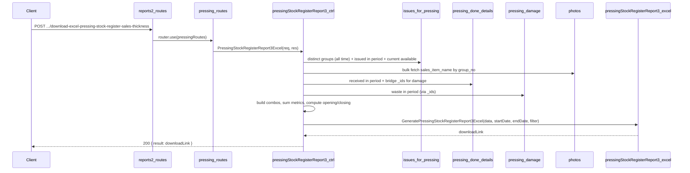

# Pressing Stock Register Report 3 — Plan
## Sales Name, Thickness

**Overview:** Add a Pressing Item Stock Register (Report 3) API under reports2 > Pressing that produces an Excel report grouped by Item Name → Sales item Name → Thickness → Size, with columns for Opening SqMtr, Issued for pressing SqMtr, Pressing received SqMtr, Pressing Waste SqMtr, and Closing SqMtr. Unlike Report 2 (group-level), Report 3 aggregates (collapses) all group_nos sharing the same `(item_name, sales_item_name, thickness, size)` into a single row. Data is sourced from `issues_for_pressing`, `pressing_done_details`, `pressing_damage`, and `photos`.

---

## Goal

Implement a **Pressing Item Stock Register — Sales Name, Thickness** report matching the specified layout:

- **Title:** `"Pressing Item Stock Register sales name - thicksens between DD/MM/YYYY and DD/MM/YYYY"`
- **Columns (9):** Item Name | Slaes item Name | Thickness | Size | Opening SqMtr | Issued for pressing SqMtr | Pressing received Sqmtr | Pressing Waste SqMtr | Closing SqMtr
- **Single header row.**
- **Grouping:** One row per distinct `(item_name, sales_item_name, thickness, size)` combo. Rows grouped by Item Name with merged Item Name cells.
- **Subtotals:** A "Total" row after each Item Name group summing all numeric columns.
- **Grand total:** A final "Total" row at the end summing all numeric columns.

**Formulas:**

```
current_available  = sum(issues_for_pressing.available_details.sqm) where is_pressing_done = false
                     (summed across all group_nos in the combo)

Opening SqMtr      = current_available + pressing_received + pressing_waste − issued_for_pressing

Closing SqMtr      = current_available
                   (algebraically = Opening + issued_for_pressing − pressing_received − pressing_waste)
```

---

## Data source and schema

- **issues_for_pressing** (`topl_backend/database/schema/factory/pressing/issues_for_pressing/issues_for_pressing.schema.js`)
  - Items issued from tapping/splicing to pressing.
  - Key fields: `group_no`, `item_name`, `thickness`, `length`, `width`, `sqm`, `available_details.sqm`, `is_pressing_done`, `createdAt`.
  - **Distinct groups (all time):** Group by `(group_no, item_name)`, keep `$first` of thickness, length, width.
  - **Issued in period:** sum(sqm) where createdAt ∈ [start, end], per `(group_no, item_name)`.
  - **Current available:** sum(available_details.sqm) where is_pressing_done = false, per `(group_no, item_name)`.

- **pressing_done_details** (`topl_backend/database/schema/factory/pressing/pressing_done/pressing_done.schema.js`)
  - One document per pressing run.
  - Key fields: `_id`, `group_no`, `sqm`, `pressing_date`.
  - **Pressing received:** sum(sqm) per group_no where pressing_date ∈ [start, end].
  - **Bridge for waste:** fetch `_id` + `group_no` for docs with pressing_date in range.

- **pressing_damage** (`topl_backend/database/schema/factory/pressing/pressing_damage/pressing_damage.schema.js`)
  - Key fields: `pressing_done_details_id`, `sqm`.
  - **Pressing Waste:** sum(sqm) per pressing_done_details_id; map back to group_no via bridge.

- **photos** (`topl_backend/database/schema/masters/photo.schema.js`)
  - Key fields: `group_no`, `sales_item_name`.
  - Used to resolve `sales_item_name` per group_no (single bulk query).

**Mapping to report columns:**

| Report column | Source / logic |
|---------------|----------------|
| Item Name | issues_for_pressing.item_name |
| Slaes item Name | photos.sales_item_name via group_no |
| Thickness | issues_for_pressing.thickness |
| Size | `length X width` (string) |
| Opening SqMtr | current_available + pressing_received + pressing_waste − issued_for_pressing |
| Issued for pressing SqMtr | issues_for_pressing.sqm where createdAt in [start, end], summed per combo |
| Pressing received Sqmtr | pressing_done_details.sqm where pressing_date in [start, end], summed per combo |
| Pressing Waste SqMtr | pressing_damage.sqm via pressing_done_details in period, summed per combo |
| Closing SqMtr | current_available (summed per combo) |

---

## API contract

- **Endpoint:** `POST /api/V1/report/download-excel-pressing-stock-register-sales-thickness`
- **Request body:** `{ startDate, endDate, filter?: { item_name? } }`.
- **Success (200):** `{ statusCode: 200, message: "Pressing stock register (sales name - thickness) generated successfully", result: "<APP_URL>/public/upload/reports/reports2/Pressing/Pressing-Stock-Register-Sales-Thickness-<timestamp>.xlsx" }`
- **Errors:** 400 if startDate/endDate missing or invalid or start > end; 404 when no distinct groups in issues_for_pressing (`"No pressing data found for the selected period"`), or all rows are all-zero (`"No pressing stock data found for the selected period"`).

---

## File and route layout

| Purpose | Path |
|---------|------|
| Controller | `controllers/reports2/Pressing/pressingStockRegisterReport3.js` |
| Excel generator | `config/downloadExcel/reports2/Pressing/pressingStockRegisterReport3.js` |
| Routes | `routes/report/reports2/Pressing/pressing.routes.js` |
| Mount | `routes/report/reports2.routes.js` — pressing router already mounted |

Reference patterns:

- **Controller + balance logic:** `pressingStockRegisterReport1.js` uses the same combo-map aggregation pattern (Report 1 is identical in aggregation but has extra columns for downstream process). Use Report 3 as the simpler reference.
- **Excel structure:** Same structure as `pressingStockRegisterReport2.js` (single header row, merged Item Name, subtotal per Item Name, grand total) — Report 3 has 9 columns vs. Report 2's 11.

---

## Implementation steps (as implemented)

### 1. Controller — `pressingStockRegisterReport3.js`

- Validate `startDate` and `endDate` (required, valid format, start ≤ end).
- Optional filter: `filter.item_name` applied as `{ item_name: filter.item_name }` on issues_for_pressing queries.
- **Step 1 — Distinct groups (all time):** Aggregate issues_for_pressing → `$group` by `(group_no, item_name)`, keep `$first` of thickness, length, width. Return 404 with `"No pressing data found..."` if empty.
- **Step 2 — Sales item names:** `photoModel.find({ group_no: { $in: allGroupNos } }, { group_no: 1, sales_item_name: 1 }).lean()` → `Map<group_no → sales_item_name>`.
- **Step 3 — Build combo map:** Iterate distinct groups:
  - `sales_item_name = salesNameMap.get(group_no) ?? ''`
  - `size = length X width`
  - `comboKey = item_name || sales_item_name || thickness || size`
  - Push group_no into `comboMap[comboKey].group_nos[]`.
  - Result: `Map<comboKey → { item_name, sales_item_name, thickness, size, group_nos[] }>`.
- **Step 4 — Bulk aggregations (4 queries, same pattern as Report 2):**
  - `issuedAgg`: issues_for_pressing where createdAt ∈ [start, end], group by `(group_no, item_name)`, sum sqm → `Map<"group_no|item_name" → total>`.
  - `pressingDoneAgg`: pressing_done_details where pressing_date ∈ [start, end] AND group_no ∈ set, group by group_no, sum sqm → `Map<group_no → total>`.
  - `damageAgg`: fetch pressing_done_details docs (pressing_date in range) → collect `_id`s; aggregate pressing_damage where pressing_done_details_id ∈ those ids, group by pressing_done_details_id, sum sqm; map to group_no → `Map<group_no → total>`.
  - `currentAgg`: issues_for_pressing where is_pressing_done = false, group by `(group_no, item_name)`, sum available_details.sqm → `Map<"group_no|item_name" → total>`.
- **Step 5 — Build stock rows:** For each combo:
  - For each `gn` in `combo.group_nos`:
    - `issued_for_pressing += issuedMap.get(gn|item_name) ?? 0`
    - `pressing_received += pressingDoneMap.get(gn) ?? 0`
    - `pressing_waste += damageByGroupNo.get(gn) ?? 0`
    - `current_available += currentMap.get(gn|item_name) ?? 0`
  - `opening_sqm = current_available + pressing_received + pressing_waste − issued_for_pressing`
  - `closing_sqm = current_available`
- Filter to "active" rows (any non-zero: opening, issued, received, waste, closing).
- Return 404 `"No pressing stock data found..."` if no active rows.
- Call `GeneratePressingStockRegisterReport3Excel(activeStockData, startDate, endDate, filter)` and return download link.

### 2. Excel generator — `pressingStockRegisterReport3.js`

- Folder: `public/upload/reports/reports2/Pressing` (created with `fs.mkdir(..., { recursive: true })`).
- Title: `"Pressing Item Stock Register sales name - thicksens between {start} and {end}"` (DD/MM/YYYY).
- **Single header row:** 9 headers — Item Name, Slaes item Name, Thickness, Size, Opening SqMtr, Issued for pressing SqMtr, Pressing received Sqmtr, Pressing Waste SqMtr, Closing SqMtr.
- `NUMERIC_START_COL = 5` (Opening SqMtr onwards).
- Sort data by item_name → sales_item_name → thickness (numeric) → size (string).
- Write detail rows. When item_name changes, insert a "Total" row (col 2 = "Total", cols 3–4 blank, numeric sums in cols 5–9). Record merge range for Item Name column (col 1).
- After all rows, write last item subtotal.
- Merge Item Name column cells across each group's detail rows and its subtotal row.
- Write grand total row (col 1: "Total"; cols 2–4 blank; numeric sums in cols 5–9).
- Apply `numFmt = '0.00'` to Thickness (col 3) and numeric cols 5–9 in data/total rows.
- `headerStyle`: bold, center, grey fill (`FFD3D3D3`), thin borders. `totalRowStyle`: bold, lighter grey fill (`FFE0E0E0`).
- Column widths: 24, 24, 12, 16, 15, 24, 22, 20, 15.
- Filename: `Pressing-Stock-Register-Sales-Thickness-{timestamp}.xlsx`.
- Return `${process.env.APP_URL}${filePath}`.

### 3. Routes — `pressing.routes.js`

- Import `PressingStockRegisterReport3Excel` from the controller.
- Define: `router.post('/download-excel-pressing-stock-register-sales-thickness', PressingStockRegisterReport3Excel)`.

### 4. Mount

- Pressing routes are already imported in `reports2.routes.js`; no change required.

---

## Flow summary



---

## Clarifications and assumptions

- **Combo aggregation in memory:** Combos are built in Node.js (not in MongoDB) to avoid a complex multi-collection grouping query. This is the same pattern as Report 1.
- **Bulk queries, not N+1:** All DB queries are bulk — one per collection. Lookup/sum per combo is done in memory using Maps.
- **Report 3 vs Report 1:** Report 3 has exactly the same data flow and combo logic as Report 1, but fewer columns (9 vs 11) — no Sales, Issue for Challan, or Damage columns. Report 3 is the "clean pressing-only" view; Report 1 is the "with downstream process" view.
- **Report 3 vs Report 2:** Report 2 gives one row per group_no (transaction level). Report 3 collapses multiple group_nos into one row per (item_name, sales_item_name, thickness, size). Use Report 2 for detailed tracing; use Report 3 for summary-by-spec.
- **"Slaes item Name" / "thicksens":** These are preserved exactly from the original layout spec to maintain consistency with the delivered Excel format.
- **Pressing waste attribution:** Attributed to the primary `group_no` field of `pressing_done_details`. Secondary groups in `group_no_array` are not credited.
- **Opening balance uses all-time history:** Distinct groups are fetched without a date filter so that opening balances reflect the full stock history.

---

## Optional later enhancements

- Add `filter.sales_item_name` to narrow by a specific sales item name.
- Add `filter.thickness` to narrow by specific thickness value.
- Correct header labels ("Sales item Name", "Thickness") in a future spec revision if the original typos are confirmed as errors.
- Wire pressing waste to only the pressing-stage waste if downstream damage is later attributed separately.
