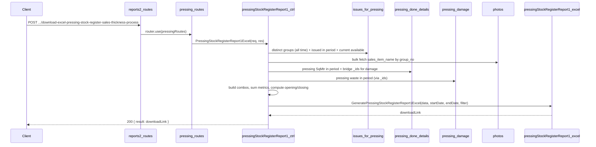

# Pressing Stock Register Report 1 — Plan
## Sales Name, Thickness, Other Process Wise

**Overview:** Add a Pressing Item Stock Register (Report 1) API under reports2 > Pressing that produces an Excel report grouped by Item Name → Sales item Name → Thickness → Size, with columns for Opening SqMtr, Pressing SqMtr, Alls Sell (Sales + Issue for Challan), All Damage, Process Waste, and Closing SqMtr. A two-row header is used: the "Alls Sell" group merges across cols 7–8, with "Sales" and "Issue for Challan" as sub-headers in the second row. Data is sourced from `issues_for_pressing`, `pressing_done_details`, `pressing_damage`, and `photos`.

---

## Goal

Implement a **Pressing Item Stock Register — Sales Name, Thickness, Other Process Wise** report that matches the specified layout:

- **Title:** `"Pressing Item Stock Register sales name - thickness - other process wise between DD/MM/YYYY and DD/MM/YYYY"`
- **Columns (11):** Item Name | Sales item Name | Thickness | Size | Opening SqMtr | Pressing SqMtr | Sales | Issue for Challan | All Damage | Process Waste | Closing SqMtr
- **Two-row header:** Cols 1–6, 9–11 span both header rows; cols 7–8 have group header "Alls Sell (Direct Pressing+Cnc+Colour+Polish)" in row A and sub-headers "Sales" / "Issue for Challan" in row B.
- **Grouping:** Rows grouped by Item Name. Merged Item Name cells across the group's detail rows and its subtotal row.
- **Subtotals:** A "Total" row after each Item Name group summing all numeric columns.
- **Grand total:** A final "Total" row at the end summing all numeric columns.

**Formulas:**

```
current_available  = sum(issues_for_pressing.available_details.sqm) where is_pressing_done = false

Opening SqMtr      = current_available + pressing_sqm + pressing_waste_sqm − issued_in_period

process_waste      = pressing_waste_sqm
sales              = 0   (schema gap)
issue_for_challan  = 0   (schema gap)
damage             = 0   (schema gap)

Closing SqMtr      = Opening SqMtr + pressing_sqm − sales − issue_for_challan − damage − process_waste
```

---

## Data source and schema

- **issues_for_pressing** (`topl_backend/database/schema/factory/pressing/issues_for_pressing/issues_for_pressing.schema.js`)
  - Items issued from tapping/splicing to pressing.
  - Key fields: `group_no`, `item_name`, `thickness`, `length`, `width`, `sqm`, `available_details.sqm`, `is_pressing_done`, `createdAt`.
  - **Distinct combos:** Group by `(group_no, item_name)` all time; then collapse to `(item_name, sales_item_name, thickness, size)` in memory.
  - **Issued in period:** sum(sqm) where createdAt ∈ [start, end], per `(group_no, item_name)`.
  - **Current available:** sum(available_details.sqm) where is_pressing_done = false, per `(group_no, item_name)`.

- **pressing_done_details** (`topl_backend/database/schema/factory/pressing/pressing_done/pressing_done.schema.js`)
  - One document per pressing run.
  - Key fields: `_id`, `group_no`, `sqm`, `pressing_date`.
  - **Pressing SqMtr:** sum(sqm) per group_no where pressing_date ∈ [start, end].
  - **Bridge for waste:** fetch `_id` + `group_no` for docs with pressing_date in range → used to join pressing_damage.

- **pressing_damage** (`topl_backend/database/schema/factory/pressing/pressing_damage/pressing_damage.schema.js`)
  - Key fields: `pressing_done_details_id`, `sqm`.
  - **Process Waste:** sum(sqm) per pressing_done_details_id; map back to group_no using the pressing_done_details bridge.

- **photos** (`topl_backend/database/schema/masters/photo.schema.js`)
  - Key fields: `group_no`, `sales_item_name`.
  - Used to resolve `sales_item_name` for each group_no (single bulk query).

**Mapping to report columns:**

| Report column | Source / logic |
|---------------|----------------|
| Item Name | issues_for_pressing.item_name |
| Sales item Name | photos.sales_item_name via group_no |
| Thickness | issues_for_pressing.thickness |
| Size | `length X width` (string) |
| Opening SqMtr | current_available + pressing_sqm + pressing_waste_sqm − issued_in_period |
| Pressing SqMtr | pressing_done_details.sqm where pressing_date in [start, end] |
| Sales | 0 (schema gap) |
| Issue for Challan | 0 (schema gap) |
| All Damage | 0 (schema gap) |
| Process Waste | pressing_damage.sqm via pressing_done_details in period |
| Closing SqMtr | Opening + Pressing − Sales − Challan − Damage − Process Waste |

---

## API contract

- **Endpoint:** `POST /api/V1/report/download-excel-pressing-stock-register-sales-thickness-process`
- **Request body:** `{ startDate, endDate, filter?: { item_name? } }` (same pattern as other reports2 pressing reports).
- **Success (200):** `{ statusCode: 200, message: "Pressing stock register (sales name - thickness - process) generated successfully", result: "<APP_URL>/public/upload/reports/reports2/Pressing/Pressing-Stock-Register-Sales-Thickness-Process-<timestamp>.xlsx" }`
- **Errors:** 400 if startDate/endDate missing or invalid or start > end; 404 when no distinct groups in issues_for_pressing, or all rows are all-zero.

---

## File and route layout

| Purpose | Path |
|---------|------|
| Controller | `controllers/reports2/Pressing/pressingStockRegisterReport1.js` |
| Excel generator | `config/downloadExcel/reports2/Pressing/pressingStockRegisterReport1.js` |
| Routes | `routes/report/reports2/Pressing/pressing.routes.js` |
| Mount | `routes/report/reports2.routes.js` — pressing router already mounted |

Reference patterns:

- **Controller + balance logic:** `pressingStockRegisterReport3.js` (same combo-map aggregation pattern), `groupingSplicingStockRegister.js` (opening/closing balance formula style).
- **Excel structure (two-row header):** Unique to this report — uses `worksheet.mergeCells(headerRowA, 7, headerRowA, 8)` for "Alls Sell" group and writes sub-headers in row B only for cols 7–8. All other header cols span both rows via `worksheet.mergeCells(headerRowA, col, headerRowB, col)`.

---

## Implementation steps (as implemented)

### 1. Controller — `pressingStockRegisterReport1.js`

- Validate `startDate` and `endDate` (required, valid format, start ≤ end).
- Optional filter by `item_name` applied as `{ item_name: filter.item_name }` on issues_for_pressing queries.
- **Step 1 — Distinct groups (all time):** Aggregate issues_for_pressing → `$group` by `(group_no, item_name)`, keep `$first` of `thickness`, `length`, `width`. Return 404 if empty.
- **Step 2 — Sales item names:** Bulk fetch from photos where `group_no` ∈ all group_nos; build `Map<group_no → sales_item_name>`.
- **Step 3 — Build combo map:** Iterate distinct groups; derive `size = length X width`; build composite key `item_name||sales_item_name||thickness||size`; collect group_nos per combo into `Map<comboKey → { item_name, sales_item_name, thickness, size, group_nos[] }>`.
- **Step 4 — Bulk aggregations (4 queries):**
  - `issuedAgg`: issues_for_pressing where createdAt ∈ [start, end], group by `(group_no, item_name)`, sum sqm → `Map<"group_no|item_name" → total>`.
  - `pressingDoneAgg`: pressing_done_details where pressing_date ∈ [start, end] AND group_no ∈ set, group by group_no, sum sqm → `Map<group_no → total>`.
  - `damageAgg`: fetch pressing_done_details docs (pressing_date in range), collect `_id`s; aggregate pressing_damage where pressing_done_details_id ∈ those ids, group by pressing_done_details_id, sum sqm; map back to group_no → `Map<group_no → total>`.
  - `currentAgg`: issues_for_pressing where is_pressing_done = false, group by `(group_no, item_name)`, sum available_details.sqm → `Map<"group_no|item_name" → total>`.
- **Step 5 — Build stock rows:** For each combo, sum all metrics across its group_nos. Compute opening/closing. Set sales = 0, issue_for_challan = 0, damage = 0, process_waste = pressing_waste_sqm.
- Filter to "active" rows (any non-zero metric).
- Return 404 if no active rows.
- Call `GeneratePressingStockRegisterReport1Excel(activeStockData, startDate, endDate, filter)` and return download link.

### 2. Excel generator — `pressingStockRegisterReport1.js`

- Folder: `public/upload/reports/reports2/Pressing` (created with `fs.mkdir(..., { recursive: true })`).
- Title: `"Pressing Item Stock Register sales name - thickness - other process wise between {start} and {end}"` (DD/MM/YYYY).
- **Two-row header:**
  - Cols 1–6, 9–11: `worksheet.mergeCells(headerRowA, col, headerRowB, col)` → one cell spanning both header rows.
  - Cols 7–8: `worksheet.mergeCells(headerRowA, 7, headerRowA, 8)` for "Alls Sell..."; then individual cells in headerRowB for "Sales" (col 7) and "Issue for Challan" (col 8) with `subHeaderStyle` (smaller font).
- Sort data by item_name → sales_item_name → thickness (numeric) → size.
- Write detail rows. When item_name changes, insert a "Total" row for the previous group (cols: ItemName, "Total", blank, blank, numeric sums). Record merge range for Item Name column.
- After all rows, write last item subtotal.
- Merge Item Name column cells across each group's detail rows and its subtotal row.
- Write grand total row (col 1: "Total"; numeric sums in cols 5–11).
- Apply `numFmt = '0.00'` to numeric cells (cols 5–11 in data/total rows; col 3 Thickness also formatted).
- `headerStyle`: bold, center, grey fill, thin borders. `subHeaderStyle`: bold, size 9, same style. `totalRowStyle`: bold, lighter grey fill.
- Column widths: 24, 24, 12, 16, 15, 15, 12, 18, 28, 15, 15.
- Filename: `Pressing-Stock-Register-Sales-Thickness-Process-{timestamp}.xlsx`.
- Return `${process.env.APP_URL}${filePath}`.

### 3. Routes — `pressing.routes.js`

- Import `PressingStockRegisterReport1Excel` from the controller.
- Define: `router.post('/download-excel-pressing-stock-register-sales-thickness-process', PressingStockRegisterReport1Excel)`.

### 4. Mount

- Pressing routes are already imported and used in `reports2.routes.js`; no change required.

---

## Flow summary



---

## Clarifications and assumptions

- **Combo aggregation in memory:** Distinct combos are built in Node.js (not in MongoDB) by iterating the group-level distinct results and grouping by composite key. This avoids a complex multi-level MongoDB aggregation across collections.
- **Bulk queries, not N+1:** All DB queries are bulk — one query per collection, returning all relevant rows at once. Lookup/sum per combo is done in memory using Maps.
- **process_waste = pressing_waste_sqm:** Until downstream damage schemas are linked, `process_waste` in the Excel is set to the pressing-stage waste (pressing_damage). When "All Damage" is later wired from downstream (CNC, colour, polishing), the `process_waste` field should be scoped to pressing-stage only.
- **Pressing waste attribution:** Waste is attributed to the `group_no` field of `pressing_done_details`. If a pressing run spans multiple groups (via `group_no_array`), secondary groups are not credited. This is a known approximation.
- **Opening balance uses all-time history:** The distinct groups step fetches from issues_for_pressing without a date filter. This is intentional — opening balance depends on the full stock history, not just the report period.

---

## Optional later enhancements

- Wire **Sales** column from challan/dispatch schema once a joining key to pressing items (by group_no or item_name + thickness + size) is available.
- Wire **Issue for Challan** from issue_for_challan schema in the same way.
- Wire **All Damage** from downstream process damage schemas (CNC damage, colour damage, polishing damage).
- Add `filter.sales_item_name` support to narrow by sales item name.
- Add `filter.thickness` support to narrow by specific thickness.
