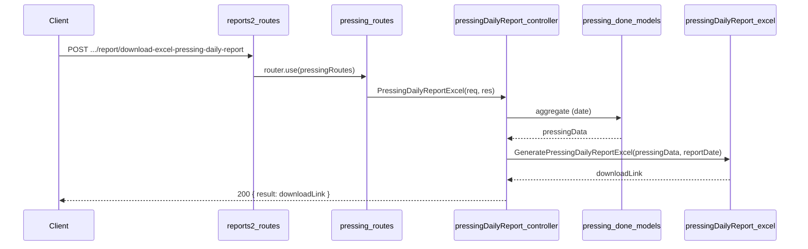

# Pressing Daily Report API Plan

**Overview:** Add a Pressing daily report API under reports2 > Pressing that produces an Excel report matching the provided layout: (1) Pressing Details table (Category, Base, Item Name, Thick., Side, Size, Sheets, Sq Mtr) from base_details with per-category totals and grand total; (2) Core - Face Consumption Sq.Mtr.; (3) Plywood Consumption Sq.Mtr. Data is sourced from pressing_done_details and pressing_done_consumed_items_details.

---

## Report layout (from spec/images)

- **Section 1 – Title:** "Pressing Details Report Date: DD/MM/YYYY"
- **Section 1 – Table:** Columns — Category, Base, Item Name, Thick., Side, Size, Sheets, Sq Mtr. Data from base_details. Category from base_type (Decorative Mdf, Decorative Plywood, Fleece Back Veneer). Size is raw length×width (no conversion). Sq Mtr calculated from length×width/10000 when missing or zero. Total per category and overall total.
- **Section 2 – Header:** "Core - Face Consumption Sq.Mtr.". Table: Item Name, Thick., Size, Sheets, Sq Mtr. Data from face_details. Total row.
- **Section 3 – Header:** "Plywood Consumption Sq.Mtr.". Table: Item Name, Thick., Size, Sheets, Sq Mtr. Data from base_details. Total row.

## Data source (schema)

- **pressing_done.schema.js** (`topl_backend/database/schema/factory/pressing/pressing_done/pressing_done.schema.js`)
  - **pressing_done_details:** `pressing_date`, `pressing_id`, `shift`, `no_of_workers`, `no_of_working_hours`, `machine_id`, `machine_name`, `length`, `width`, `no_of_sheets`, `sqm`, `product_type`, `group_no`, `remark`, `flow_process`, `created_by`. Use `_id` for join to consumed items.
  - **pressing_done_consumed_items_details:** `pressing_done_details_id` → pressing_done_details._id. Contains:
    - **base_details[]:** `base_type`, `item_name`, `length`, `width`, `thickness`, `no_of_sheets`, `sqm` (→ Section 1 and 3).
    - **face_details[]:** `item_name`, `length`, `width`, `thickness`, `no_of_sheets`, `sqm` (→ Section 2).

## API contract

- **Endpoint:** `POST /api/v1/report/download-excel-pressing-daily-report`
- **Request body:** `{ "filters": { "reportDate": "YYYY-MM-DD" } }`. No optional session filter (all pressings for the date).
- **Success (200):** `{ result: "<APP_URL>/public/upload/reports/reports2/Pressing/...", statusCode: 200, status: "success", message: "..." }`
- **Errors:** 400 if `reportDate` missing; 404 if no data for the date.

## File structure

| Purpose         | Path |
| --------------- | ----- |
| Controller      | `controllers/reports2/Pressing/pressingDailyReport.js` |
| Excel generator | `config/downloadExcel/reports2/Pressing/pressingDailyReport.js` |
| Routes          | `routes/report/reports2/Pressing/pressing.routes.js` |
| Mount           | `routes/report/reports2.routes.js` — pressing router already added |
| API doc         | `docs/reports2/Pressing/daily_pressing/PRESSING_DAILY_REPORT_API.md` |
| Plan doc        | `docs/reports2/Pressing/daily_pressing/PRESSING_DAILY_REPORT_PLAN.md` |

## Implementation steps

### 1. Controller — `controllers/reports2/Pressing/pressingDailyReport.js`

- Use `catchAsync`, validate `reportDate` from `req.body.filters`.
- Date range: start-of-day to end-of-day for `reportDate`.
- Aggregation pipeline:
  - **$match** on `pressing_done_details`: `pressing_date` in range.
  - **$lookup** `pressing_done_consumed_items_details` on `_id` → `pressing_done_details_id` (as `consumedItems`).
  - **$lookup** `users` on `created_by` for worker name (first_name, last_name).
  - **$addFields**: `consumed` = first element of consumedItems; `workerName` = trim(concat first_name, " ", last_name).
  - **$sort** by pressing_id, product_type.
- If no documents: return 404.
- Call Excel generator with (pressingData, reportDate); return 200 with download link.

### 2. Excel config — `config/downloadExcel/reports2/Pressing/pressingDailyReport.js`

- Export `GeneratePressingDailyReportExcel(pressingData, reportDate)`.
- Use ExcelJS; date format DD/MM/YYYY.
- **Sheet layout:**
  - **Section 1:** Merged title "Pressing Details Report Date: &lt;formattedDate&gt;". Table: Category, Base, Item Name, Thick., Side, Size, Sheets, Sq Mtr. Build from doc’s consumed.base_details; map base_type to Category/Base; Size = raw length×width; Sq Mtr = sqm or (length×width/10000) when missing. Group by category; category total and section total.
  - **Section 2:** Header "Core - Face Consumption Sq.Mtr.". Table from face_details; group by item/size; total row.
  - **Section 3:** Header "Plywood Consumption Sq.Mtr.". Table from base_details by item_name; total row.
- Styling: bold section headers, gray fill for column headers, thin borders, number formats (0.00).
- Save to `public/upload/reports/reports2/Pressing/pressing_daily_report_&lt;timestamp&gt;.xlsx`; return `APP_URL + filePath`.

### 3. Routes — `routes/report/reports2/Pressing/pressing.routes.js`

- Import `PressingDailyReportExcel` from the controller and `express.Router()`.
- Define: `router.post('/download-excel-pressing-daily-report', PressingDailyReportExcel)`.
- Export default router.

### 4. Mount Pressing routes — `routes/report/reports2.routes.js`

- Import pressing routes and `router.use(pressingRoutes)` (same pattern as other reports2 modules).

## Flow summary

## Notes

- **Side** in Pressing Details is not in the schema; column is present and left blank (or placeholder).
- **Category** is derived: MDF → "Decorative Mdf", PLYWOOD → "Decorative Plywood", FLEECE_PAPER → "Fleece Back Veneer".
- **Size** is raw length×width (no unit conversion), e.g. "75 X 72".
- **Sq Mtr** is used from DB when present and > 0; otherwise calculated as (length × width) / 10000 (assumes cm).
