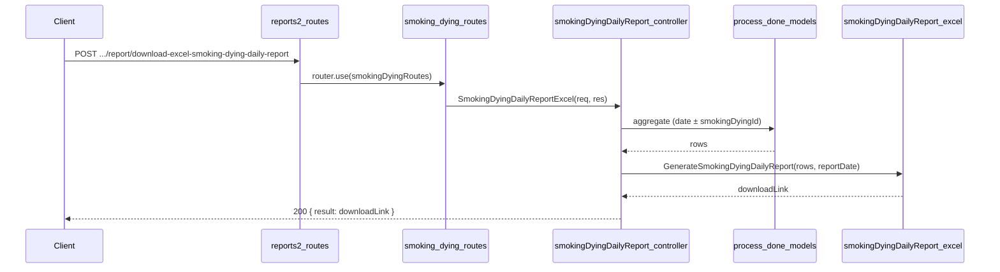

# Smoking&Dying (Dyeing) Daily Report API Plan

**Overview:** Add a Smoking&Dying daily report API under reports2 > Smoking&Dying that produces an Excel report matching the provided images: a main table with Item Name, New Item Name, and LogX (merged vertically per log group), then Bundle No, Sq Mtr, Colour Code, Remarks; a Total row for bundle count and total Sq Mtr; and a session metadata table at the end (Dyeing Id, Shift, Work Hours, Worker, Machine Id). Data is sourced from process_done_details and process_done_items_details.

---

## Report layout (from images)

- **Title:** "Dyeing Details Report Date: DD/MM/YYYY"
- **Left block (grouped by LogX):** Item Name | New Item Name | LogX — same value per log group, **merged vertically** across all bundle rows for that log.
- **Right block (per bundle):** Bundle No | Sq Mtr | Colour Code | Remarks — one row per bundle.
- **Total row:** One row with total bundle count and total Sq Mtr (e.g. 51, 559.55).
- **Session table (at end):** Dyeing Id | Shift | Work Hours | Worker | Machine Id — one row per smoking/dying session. (Machine Id is not in current schema; show blank.)

## Data source (schema)

- **smoking_dying_done.schema.js** (`topl_backend/database/schema/factory/smoking_dying/smoking_dying_done.schema.js`)
  - **process_done_details:** `process_done_date`, `shift`, `no_of_workers`, `no_of_working_hours`, `no_of_total_hours`, `created_by`. Use `_id` as "Dyeing Id".
  - **process_done_items_details:** `process_done_id`, `item_name` (→ Item Name), `item_sub_category_name` (→ New Item Name), `log_no_code` (→ LogX), `bundle_number`, `sqm` (→ Sq Mtr), `color_name` (→ Colour Code), `remark` (→ Remarks).

Worker name: resolve `created_by` via lookup to `users` (first_name, last_name), same pattern as dressingDailyReport.js.

## API contract

- **Endpoint:** `POST /api/V1/report/download-excel-smoking-dying-daily-report`
- **Request body:** `{ "filters": { "reportDate": "YYYY-MM-DD" } }`  
  Optional: `smokingDyingId` (ObjectId of process_done_details) to restrict to one session; if omitted, include all sessions for that date.
- **Success (200):** `{ result: "<APP_URL>/public/reports/SmokingDying/...", statusCode: 200, status: "success", message: "..." }`
- **Errors:** 400 if `reportDate` missing or invalid smokingDyingId; 404 if no data for the date (or for the given smokingDyingId).

## File structure

| Purpose         | Path |
| --------------- | ----- |
| Controller      | `controllers/reports2/Smoking&Dying/smokingDyingDailyReport.js` |
| Excel generator | `config/downloadExcel/reports2/Smoking&Dying/smokingDyingDailyReport.js` |
| Routes          | `routes/report/reports2/Smoking&Dying/smoking_dying.routes.js` |
| Mount           | `routes/report/reports2.routes.js` — smokingDyingRoutes |

## Implementation steps

### 1. Controller — `controllers/reports2/Smoking&Dying/smokingDyingDailyReport.js`

- Use `catchAsync`, validate `reportDate` from `req.body.filters`; optionally read `smokingDyingId`.
- Date range: start-of-day to end-of-day for `reportDate`.
- Aggregation pipeline:
  - **$match** on `process_done_details`: `process_done_date` in range; if `smokingDyingId` provided, also `_id: ObjectId(smokingDyingId)`.
  - **$lookup** `process_done_items_details` on `_id` → `process_done_id`.
  - **$unwind** items.
  - **$lookup** `users` on `created_by` for worker name (first_name, last_name).
  - **$sort** by `log_no_code`, `bundle_number`.
  - **$project** fields needed for Excel: item_name, item_sub_category_name, log_no_code, bundle_number, sqm, color_name, remark; from process_done_details: _id (process_done_id), shift, no_of_working_hours, no_of_workers; worker name from users.
- If no documents: return 404.
- Call Excel generator with (rows, reportDate); return 200 with download link.

### 2. Excel config — `config/downloadExcel/reports2/Smoking&Dying/smokingDyingDailyReport.js`

- Export `GenerateSmokingDyingDailyReport(rows, reportDate)`.
- Use ExcelJS; date format DD/MM/YYYY (reuse pattern from dressingDailyReport.js).
- **Sheet layout:**
  - Row 1: merged title — "Dyeing Details Report Date: &lt;formattedDate&gt;".
  - Main table: headers — Item Name, New Item Name, LogX, Bundle No, Sq Mtr, Colour Code, Remarks. One row per bundle; **merge cells** for columns 1–3 (Item Name, New Item Name, LogX) per contiguous log group (same process_done_id + same log_no_code).
  - Total row: label "Total"; column 4 = total bundle count (row count); column 5 = sum of Sq Mtr.
  - Session table: labels Dyeing Id, Shift, Work Hours, Worker, Machine Id; one data row per unique process_done_id (process_done_id, shift, no_of_working_hours, worker name; Machine Id blank).
- Styling: bold headers, gray fill (e.g. D3D3D3), thin borders, number format for Sq Mtr (0.00).
- Save to `public/reports/SmokingDying/smoking_dying_daily_report_&lt;timestamp&gt;.xlsx`; return `APP_URL + filePath`.

### 3. Routes — `routes/report/reports2/Smoking&Dying/smoking_dying.routes.js`

- Import `SmokingDyingDailyReportExcel` from the controller and `express.Router()`.
- Define: `router.post('/download-excel-smoking-dying-daily-report', SmokingDyingDailyReportExcel)`.
- Export default router.

### 4. Mount Smoking&Dying routes — `routes/report/reports2.routes.js`

- Import smoking dying routes: `import smokingDyingRoutes from './reports2/Smoking&Dying/smoking_dying.routes.js';`
- Add: `router.use(smokingDyingRoutes);` (same pattern as Dressing — no path prefix, so full path is `/download-excel-smoking-dying-daily-report` under the report base).

## Flow summary

## Notes

- **Item Name / New Item Name:** Map to `item_name` and `item_sub_category_name` from `process_done_items_details`.
- **Machine Id:** Not present in `process_done_details`; include column/label and leave value empty.
- **Worker:** Map to user display name from `created_by`; use "Worker" for the label. Use `no_of_working_hours` for Work Hours.
- **Totals:** Total bundle count = number of aggregated rows; Total Sq Mtr = sum of `sqm` over all rows.
- **Merged cells:** When iterating rows, detect log-group boundaries (same process_done_id + same log_no_code) and call `worksheet.mergeCells(firstRow, col, lastRow, col)` for columns 1, 2, 3.
