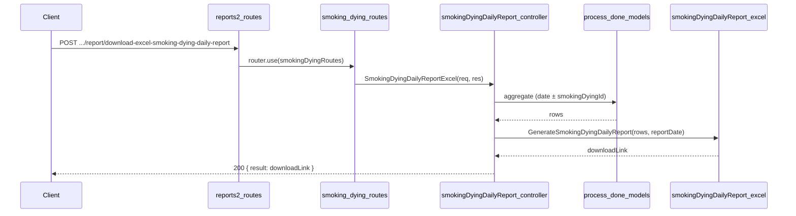

# Smoking Daily Report API Plan

**Overview:** The Smoking Daily Report API under reports2 > Smoking&Dying produces an Excel report with a main table (Item Name, LogX merged vertically per log group, Bundle No, ThickneSS, Length, Width, Leaves, Sq Mtr, PROCESS, Process color, Character, Pattern, Series, Remarks); subtotal rows per item (label "TOTAL"); a Grand Total row; and a Summary section (ITEM NAME, RECEIVED MTR., PROCESS NAME, LEAVE, PRODUCTION SQ. MTR). Data is sourced from process_done_details and process_done_items_details.

---

## Report layout

- **Title:** "Smoking Details Report Date: DD/MM/YYYY"
- **Main table:** Item Name | LogX | Bundle No | ThickneSS | Length | Width | Leaves | Sq Mtr | PROCESS | Process color | Character | Pattern | Series | Remarks — one row per bundle.
- **Merge:** Item Name and LogX merge vertically when same (per log group: same process_done_id + same log_no_code).
- **Subtotal rows:** After each item group, a row with label "TOTAL" and sum of Leaves and Sq Mtr.
- **Grand Total row:** One row with overall Leaves and Sq Mtr.
- **Summary section (at end):** SUMMERY — ITEM NAME | RECEIVED MTR. | PROCESS NAME | LEAVE | PRODUCTION SQ. MTR — one row per unique item name, plus TOTAL row.

## Data source (schema)

- **smoking_dying_done.schema.js** (`topl_backend/database/schema/factory/smoking_dying/smoking_dying_done.schema.js`)
  - **process_done_details:** `process_done_date`, `_id` (process_done_id for merge logic).
  - **process_done_items_details:** `process_done_id`, `item_name`, `log_no_code`, `bundle_number`, `thickness`, `length`, `width`, `no_of_leaves`, `sqm`, `process_name`, `color_name`, `character_name`, `pattern_name`, `series_name`, `remark`.

## API contract

- **Endpoint:** `POST /api/V1/report/download-excel-smoking-dying-daily-report`
- **Request body:** `{ "filters": { "reportDate": "YYYY-MM-DD" } }`  
  Optional: `smokingDyingId` (ObjectId of process_done_details) to restrict to one session; if omitted, include all sessions for that date.
- **Success (200):** `{ result: "<APP_URL>/public/reports/SmokingDying/...", statusCode: 200, status: "success", message: "..." }`
- **Errors:** 400 if `reportDate` missing or invalid smokingDyingId; 404 if no data for the date (or for the given smokingDyingId).

## File structure

| Purpose         | Path |
| --------------- | ----- |
| Controller      | `controllers/reports2/Smoking&Dying/smokingDyingDailyReport.js` |
| Excel generator | `config/downloadExcel/reports2/Smoking&Dying/smokingDyingDailyReport.js` |
| Routes          | `routes/report/reports2/Smoking&Dying/smoking_dying.routes.js` |
| Mount           | `routes/report/reports2.routes.js` — smokingDyingRoutes |

## Implementation steps

### 1. Controller — `controllers/reports2/Smoking&Dying/smokingDyingDailyReport.js`

- Use `catchAsync`, validate `reportDate` from `req.body.filters`; optionally read `smokingDyingId`.
- Date range: start-of-day to end-of-day for `reportDate`.
- Aggregation pipeline:
  - **$match** on `process_done_details`: `process_done_date` in range; if `smokingDyingId` provided, also `_id: ObjectId(smokingDyingId)`.
  - **$lookup** `process_done_items_details` on `_id` → `process_done_id`.
  - **$unwind** items.
  - **$sort** by `items.item_name`, `items.log_no_code`, `items.bundle_number`.
  - **$project** fields: process_done_id, item_name, log_no_code, bundle_number, thickness, length, width, no_of_leaves, sqm, process_name, color_name, character_name, pattern_name, series_name, remark.
- If no documents: return 404.
- Call Excel generator with (rows, reportDate); return 200 with download link.

### 2. Excel config — `config/downloadExcel/reports2/Smoking&Dying/smokingDyingDailyReport.js`

- Export `GenerateSmokingDyingDailyReport(rows, reportDate)`.
- Use ExcelJS; date format DD/MM/YYYY.
- **Sheet layout:**
  - Row 1: merged title — "Smoking Details Report Date: &lt;formattedDate&gt;".
  - Main table: headers — Item Name, LogX, Bundle No, ThickneSS, Length, Width, Leaves, Sq Mtr, PROCESS, Process color, Character, Pattern, Series, Remarks. One row per bundle; **merge cells** for columns 1–2 (Item Name, LogX) per contiguous log group (same process_done_id + same log_no_code).
  - Subtotal row per item: label "TOTAL", Leaves sum, Sq Mtr sum.
  - Grand Total row: label "Total", overall Leaves and Sq Mtr.
  - Summary section: SUMMERY — ITEM NAME | RECEIVED MTR. | PROCESS NAME | LEAVE | PRODUCTION SQ. MTR; one row per unique item_name; TOTAL row at end.
- Styling: bold headers, gray fill (e.g. D3D3D3), thin borders, number format for numeric columns (0.00).
- Save to `public/reports/SmokingDying/smoking_dying_daily_report_&lt;timestamp&gt;.xlsx`; return `APP_URL + filePath`.

### 3. Routes — `routes/report/reports2/Smoking&Dying/smoking_dying.routes.js`

- Import `SmokingDyingDailyReportExcel` from the controller and `express.Router()`.
- Define: `router.post('/download-excel-smoking-dying-daily-report', SmokingDyingDailyReportExcel)`.
- Export default router.

### 4. Mount Smoking&Dying routes — `routes/report/reports2.routes.js`

- Import smoking dying routes: `import smokingDyingRoutes from './reports2/Smoking&Dying/smoking_dying.routes.js';`
- Add: `router.use(smokingDyingRoutes);` (same pattern as Dressing — no path prefix, so full path is `/download-excel-smoking-dying-daily-report` under the report base).

## Flow summary

## Notes

- **Item Name / LogX:** Map to `item_name` and `log_no_code` from `process_done_items_details`; merge vertically per log group.
- **Process color:** Map to `color_name` from `process_done_items_details`.
- **Subtotal rows:** Label "TOTAL" only (no item name); sum Leaves and Sq Mtr per item group.
- **Summary section:** Group by item_name; RECEIVED MTR. = PRODUCTION SQ. MTR (same value); PROCESS NAME from first occurrence; LEAVE and PRODUCTION SQ. MTR = sum of no_of_leaves and sqm.
- **Merged cells:** Detect log-group boundaries (same process_done_id + same log_no_code) and merge columns 1 (Item Name) and 2 (LogX).
